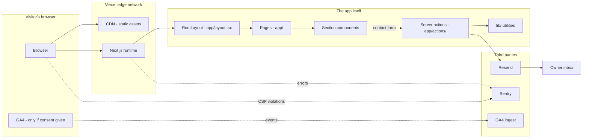
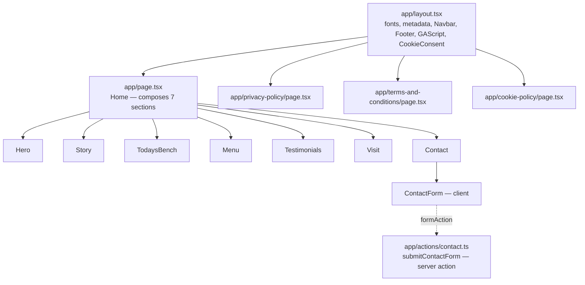
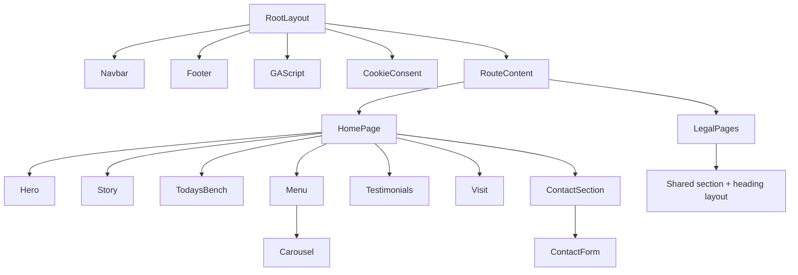
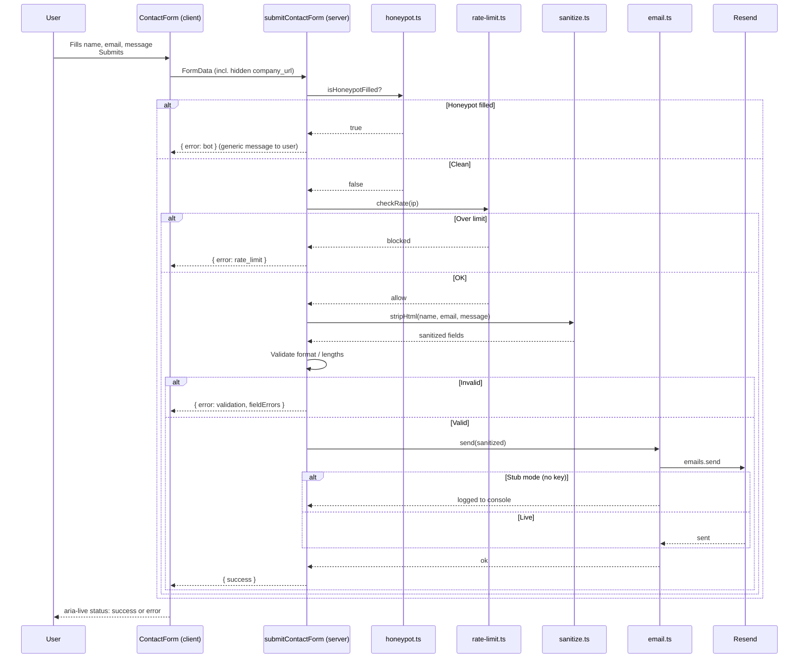
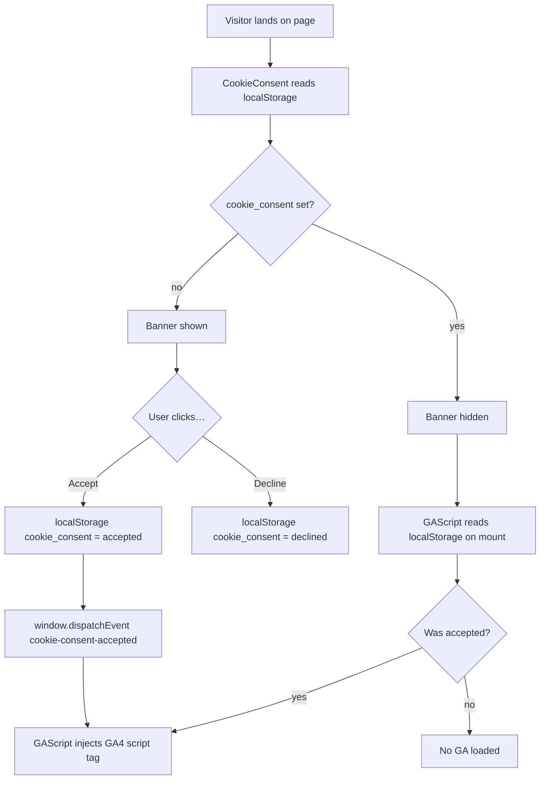

# ARCHITECTURE.md

System design for Hjem Kensington. Read this once before making structural
changes — it explains *why* things are shaped the way they are. For the
*what* (folder tree, naming conventions), see [CLAUDE.md](CLAUDE.md).

---

## System overview



The site itself is a brochure — almost everything is statically rendered. The
only mutation is the contact form, which goes through one server action that
runs every defensive layer (honeypot → rate limit → sanitize → validate →
send) before touching Resend.

---

## App Router file map



> ℹ️ **Single `<main>` rule:** RootLayout deliberately does NOT wrap children in
> `<main>`. Each page owns its own `<main>` landmark. The homepage's `<main>`
> lives in `app/page.tsx`; the legal pages each render their own. Two `<main>`s
> in a single document is invalid HTML and breaks screen-reader landmark navigation.

---

## Component hierarchy



Component classification:

| Type | Examples | Why |
|---|---|---|
| Server (default) | RootLayout, page.tsx files, Story, TodaysBench, Visit | Render at request time, can read env, no JS shipped to browser |
| Client (`'use client'`) | Hero, Menu, Carousel, ContactForm, CookieConsent, Navbar, GAScript | Need state, effects, refs, browser APIs, or event handlers |

---

## Contact form flow

The most security-sensitive piece of the site — five layers before email leaves
the server.



Every layer can fail-close. A bot-rejected submission and a server error look
identical to the user — bots can't iterate around defences they can't observe.

---

## Cookie consent flow

GA4 must not load before consent on UK/EU/California sites. The consent banner
gates GA's `<script>` injection through a custom DOM event.



> ⚠️ **The localStorage read MUST be inside `useEffect`.** Server-side rendering
> has no localStorage; reading it during initial render hydration-mismatches.

---

## State management

There is no global state library (Redux, Zustand, etc.). Justification:

| Need | How it's handled |
|---|---|
| Form submission state | `useActionState` (React 19) — `pending` + return value |
| Cookie consent | `localStorage` + custom DOM event |
| Carousel position | `useState` local to Hero / Menu |
| Mobile nav open/closed | `useState` local to Navbar |
| Theme / dark mode | (n/a — single light theme) |
| Auth | (n/a — no user accounts) |

Anything more needs a deliberate decision. A brochure site doesn't have client
state worth promoting to a store.

---

## Styling system

Tailwind v4 with CSS-first config. Brand tokens defined in
[app/globals.css](../app/globals.css):

```css
@theme {
  --color-cream: #efe8dc;
  --color-moss:  #2f3e33;
  --color-ink:   #1f1a14;
  --color-clay:  #b58a78;
  --color-bone:  #f0e8da;
  --font-display: var(--font-display-loaded), Georgia, serif;
  --font-body:    var(--font-body-loaded), system-ui, sans-serif;
}
```

These automatically generate `bg-*`, `text-*`, `border-*`, `ring-*` utilities.

Rule: **no arbitrary hex values in component classes.** Use named tokens.
`bg-cream` ✓ — `bg-[#efe8dc]` ✗. The point is that changing one value in
`globals.css` updates the whole site.

Where custom styles live:

| Type of style | Where |
|---|---|
| Brand tokens | `app/globals.css` `@theme { … }` |
| Body defaults (font, background) | `app/globals.css` `body { … }` |
| Component-specific styles | Inline as Tailwind utility classes on the component |
| Reduced-motion override | `app/globals.css` `@media (prefers-reduced-motion: reduce)` |

For the full design system (type scale, animation, spacing), see [DESIGN.md](DESIGN.md).

---

## External dependencies

| Package | Purpose | Why this one |
|---|---|---|
| `next` | Framework | Industry standard for React + SSR. App Router is the right primitive for a brochure site with one form. |
| `react` / `react-dom` | UI runtime | Required by Next. |
| `@sentry/nextjs` | Error monitoring | First-party Next integration. CSP `report-to` support out of the box. Free tier handles a brochure site. |
| `next-sitemap` | Sitemap + robots.txt | Auto-runs as `postbuild` hook. Cleaner than maintaining sitemap.xml by hand. |
| `resend` | Transactional email | Vercel has no built-in email. Resend has the cleanest API + a generous free tier (3k/month). |
| `embla-carousel-react` + `embla-carousel-autoplay` | Hero + Menu carousels | ~5 KB gzipped, accessibility-first. Swiper is 40 KB+ and adds a CSS dependency. |
| `@testing-library/react` + `jest-dom` + `user-event` | Component tests | Industry standard. Encourages testing behaviour, not implementation. |
| `jest-axe` | Accessibility tests | The Jest matcher integration of axe-core. (`@axe-core/react` is a runtime logger, not a test matcher.) |
| `msw` | Network mocks | Intercepts fetch/XHR in tests so we never hit real APIs in CI. |
| `next/jest` | Jest transformer | Matches how Next compiles the real app — keeps tests and prod in sync. |
| `husky` + `lint-staged` | Git hooks | Pre-commit (tsc + eslint) + pre-push (full test suite). Catches breakage before it reaches the remote. |

---

## Performance decisions

| What | Why deferred / lazy | Impact |
|---|---|---|
| Hero image (slide 1) | `priority={true}` — eagerly loaded | Improves LCP — hero image is the largest paint |
| Hero images 2 + 3 | Default `priority={false}` | They're below-fold during initial paint |
| Section images (Story, Menu, Testimonials avatars) | Default lazy via `next/image` | Browser uses IntersectionObserver to load on scroll-near |
| GA4 script tag | Only injected after consent | Initial page load has no analytics overhead at all if user declines |
| Sentry SDK | Loaded async via `instrumentation-client.ts` | Doesn't block first paint |
| Fraunces + DM Sans | `display: swap` (next/font default) | Avoids invisible-text-during-load (FOIT) |
| CSP `report-uri` | Only set when Sentry DSN configured | Avoids browser warnings on demo build |

Animation rule: **transform and opacity only — never `top`, `left`, `width`,
`height`.** The first two are GPU-composited and don't trigger layout. The rest
trigger layout, hurting CLS scores. See [PERFORMANCE.md](PERFORMANCE.md).

---

## Security posture

A brochure site is a small attack surface, but the contact form and the static
page bundle still have to be hardened against:

| Threat | Defence |
|---|---|
| XSS | CSP (no inline scripts allowed in production), HTML-stripping sanitization on every input |
| Clickjacking | `frame-ancestors 'none'` in CSP, `X-Frame-Options: DENY` belt-and-braces |
| MIME sniffing | `X-Content-Type-Options: nosniff` |
| Form spam (bots) | Honeypot field + rate limiting (3 / 10 minutes / IP) |
| Form spam (humans) | Rate limiting only — humans rarely re-submit fast enough to trip it |
| MITM downgrade | HSTS with `preload` + `includeSubDomains` |
| Session token tabnabbing | `Cross-Origin-Opener-Policy: same-origin`, all external links carry `rel="noopener noreferrer"` |
| Referrer leakage | `Referrer-Policy: strict-origin-when-cross-origin` |
| Permission abuse | `Permissions-Policy` denies camera, mic, geolocation, browsing-topics, interest-cohort |
| Cross-origin asset hot-linking | `Cross-Origin-Resource-Policy: same-origin` |

For full details, see [SECURITY.md](SECURITY.md).

---

## Scaling notes

The site is sized for a small West London bakery. If traffic 10x'd:

| Bottleneck | At scale, do this instead |
|---|---|
| In-memory rate limiter resets on cold start (Vercel serverless) | Move to Upstash Redis or Vercel KV — same `lib/rate-limit.ts` interface, swap the storage backend |
| Resend free tier (3k emails/month) | Either upgrade Resend or switch to a different provider — `lib/email.ts` is the single integration point |
| Sentry free tier event quota | Upgrade plan, or sample errors via `tracesSampleRate` in `sentry.client.config.ts` |
| One Vercel deployment | Add Vercel Preview deploys per PR — already free, just enable in the dashboard |
| Static images served from `public/` | Already CDN-fronted by Vercel — no change needed below ~1M requests/month |

The code is intentionally *not* designed for massive scale. Adding the
infrastructure for a SaaS-grade site to a brochure site would be the wrong
trade. The integration points are factored so a swap is straightforward when
the need arrives.
