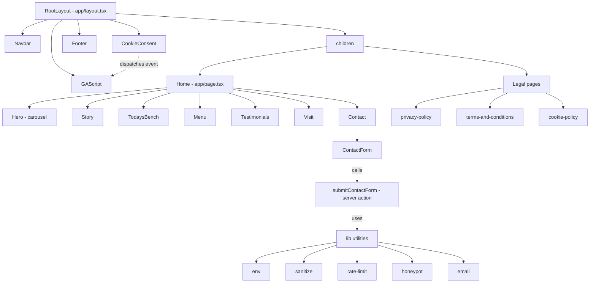

# CLAUDE.md — Project Brain

> **Read this first.** Every Claude Code session in this project should start by
> reading this file. It is the durable memory of how the codebase is shaped,
> what decisions have been made, and what NOT to change without asking.
>
> **Last updated:** 2026-05-08 (end of Step 21 — Session 11)

---

## At a glance

| Field | Value |
|---|---|
| Project | Hjem Kensington |
| Business | Small Danish bakery & specialty coffee shop |
| Location | Gloucester Road, Kensington, West London, UK |
| Status | Speculative demo — not yet pitched to client |
| Operator | Essam Noureldin (solo freelancer) |
| Live URL | (none yet — Vercel preview only) |
| Repo | `Essam-Noureldin/hjem-kensington` on GitHub |

> ℹ️ **Note:** This is a **speculative build**. The owners of Hjem don't know
> the site exists yet. Essam's workflow is research → demo → pitch →
> close → retainer. Everything in this codebase is a sales asset until that
> conversation lands.

---

## Stack — exact versions installed

| Layer | Tech | Version |
|---|---|---|
| Framework | Next.js (App Router, Turbopack) | 16.2.4 |
| UI runtime | React | 19.2.4 |
| Styling | Tailwind CSS (v4 — CSS-first config) | 4.x |
| Animation | Framer Motion (via Embla for hero) | (carousel-only) |
| Carousel | embla-carousel-react + autoplay | 8.6 |
| Fonts | Fraunces, DM Sans (via `next/font/google`) | self-hosted |
| Email | Resend | 6.12 |
| Errors | Sentry (`@sentry/nextjs`) | 10.52 |
| SEO | next-sitemap | 4.2 |
| Tests | Jest + Testing Library + jest-axe + MSW | 30 / 16 / 10 / 2 |
| Hooks | husky + lint-staged | 9 / 16 |
| Lang | TypeScript | 5.x |
| Node | (`.nvmrc` + `engines`) | ≥20.0.0 |

> ⚠️ **Warning — read this before writing any Next.js code.**
> Next 16 has breaking changes from earlier majors (async `params`/`searchParams`,
> Turbopack default, different manifest formats). The repo's root `AGENTS.md`
> says explicitly: "This is NOT the Next.js you know." When in doubt, check
> `node_modules/next/dist/docs/` rather than relying on training data.

> ⚠️ **Tailwind v4, not v3.** No `tailwind.config.ts` exists. Brand tokens
> live in [app/globals.css](../app/globals.css) inside an `@theme { … }`
> block. Adding a JS Tailwind config will silently double-register tokens
> and confuse future-you.

---

## Folder tree

```
hjem-kensington/
├── app/                          ← Next.js App Router pages
│   ├── layout.tsx                  Root layout — fonts, metadata, Navbar/Footer
│   ├── page.tsx                    Homepage — assembles 7 section components
│   ├── globals.css                 Tailwind v4 @theme tokens + body defaults
│   ├── actions/
│   │   └── contact.ts              Server action for the contact form
│   ├── privacy-policy/page.tsx     Legal page 1
│   ├── terms-and-conditions/page.tsx  Legal page 2
│   └── cookie-policy/page.tsx      Legal page 3
│
├── components/
│   ├── Navbar.tsx                  Sticky nav, hamburger on mobile
│   ├── Footer.tsx                  Legal trio + Instagram + copyright
│   ├── ContactForm.tsx             Client form with honeypot (reads server action)
│   ├── CookieConsent.tsx           Consent banner — gates GA
│   ├── Carousel.tsx                Generic embla wrapper used by Menu
│   ├── analytics/
│   │   └── GAScript.tsx            Listens for consent event, injects GA4 tag
│   └── sections/
│       ├── Hero.tsx                3-slide auto-rotating carousel
│       ├── Story.tsx               "Our story" + image grid
│       ├── TodaysBench.tsx         Today's specials grid
│       ├── Menu.tsx                Carousel of menu cards
│       ├── Testimonials.tsx        Three review cards with avatars
│       ├── Visit.tsx               Address, hours, map placeholder
│       └── Contact.tsx             Wrapper for ContactForm
│
├── lib/                          ← Shared utilities (one file = one concern)
│   ├── env.ts                      Typed env validator — singleton
│   ├── sanitize.ts                 Strip HTML before processing input
│   ├── rate-limit.ts               In-memory IP-based rate limiter
│   ├── honeypot.ts                 isHoneypotFilled() — bot detector
│   ├── email.ts                    Resend wrapper (stub mode if keys missing)
│   └── sentry.ts                   Sentry helpers + CSP report URL builder
│
├── tests/                        ← Mirrors source layout
│   ├── unit/
│   │   ├── lib/                    env, sanitize, rate-limit, honeypot, email, sentry
│   │   └── components/             Per-component, plus sections/
│   ├── integration/
│   │   ├── api/                    contact-form server action, security headers
│   │   └── flows/                  legal-pages, cookie-consent-ga
│   └── smoke/                      render, navigation, accessibility
│
├── public/
│   └── images/                     All site imagery (see IMAGES.md)
│
├── instrumentation.ts            ← Sentry edge/server bootstrap
├── instrumentation-client.ts     ← Sentry client bootstrap
├── sentry.server.config.ts
├── sentry.edge.config.ts
├── next.config.ts                ← Headers + CSP + Sentry wrap
├── next-sitemap.config.js
├── jest.config.ts
├── jest.setup.ts                 ← matchMedia/IntersectionObserver mocks
├── Dockerfile                    ← Multi-stage build (deps → builder → runner)
├── docker-compose.yml            ← Local dev (with hot reload)
├── docker-compose.prod.yml       ← Production-like preview
├── .husky/                       ← Git hooks (pre-commit, pre-push)
├── .nvmrc                        ← `20`
├── .env.example                  ← Reference for every env var
├── AGENTS.md                     ← "This is NOT the Next.js you know"
├── CLAUDE.md                     ← Just `@AGENTS.md` (loads AGENTS.md)
├── MASTER_PROMPT_DEVIATIONS.md   ← Living deviation log — updated every session
├── SESSION_HANDOFF.md            ← Generated at end of each session
└── docs/                         ← THIS FOLDER (15 markdown files)
```

> ℹ️ **Note:** The root `CLAUDE.md` is intentionally just `@AGENTS.md`.
> Claude Code auto-loads it; the `@`-import pattern pulls AGENTS.md into
> context so the "this isn't the Next.js you know" warning fires on every
> session. This file (`docs/CLAUDE.md`) is the rich project brain.

---

## Component hierarchy



---

## Architectural decisions (with reasoning)

| Decision | Reasoning | Alternatives rejected |
|---|---|---|
| **Tailwind v4 (CSS-first)** | Faster builds, simpler mental model, official default since late 2024 | v3 with `tailwind.config.ts` — adds JS layer for no benefit |
| **next/font/google for self-hosted fonts** | Fonts download at build time, served from `/_next/static`. Tighter CSP (no `fonts.googleapis.com` whitelist needed) and zero runtime requests to Google. | CDN `<link>` tags — leaks visitor IP to Google on every page load |
| **In-memory rate limiter** | Low-traffic local business site. A Map with TTL cleanup handles volume comfortably. Resets on server restart — acceptable for a contact form. | Redis/Upstash — operational overhead unjustified at this scale |
| **Resend for email** | Vercel has no built-in email. Resend has a clean API, generous free tier (3k/month), and Next.js Server Actions integration. | SendGrid (heavier), nodemailer + SMTP (config nightmare) |
| **Sentry for errors** | Free tier handles a brochure site comfortably. Integrates via `withSentryConfig` wrap of `next.config.ts`. CSP `report-to` plus client + server + edge instrumentation files. | Self-hosted ELK/Grafana — far overkill |
| **Server actions for contact form** | Native to App Router. Progressive enhancement out of the box. `useActionState` gives `pending` for free. | API route — extra ceremony for a single endpoint |
| **Embla for carousels** | ~5KB, accessibility-first, handles touch + keyboard cleanly. Used in Hero (3 slides) and Menu. | Swiper (40KB+), hand-rolled (a11y burden) |
| **Sentry build plugin `silent: true`** | Demo build has no `SENTRY_AUTH_TOKEN` → would log "skipping source map upload" on every build. Silenced for cleanliness. **Remove `silent: true` and set `SENTRY_AUTH_TOKEN` in Vercel when ready to upload source maps for production.** | — |
| **`output: "standalone"` in `next.config.ts`** | Required by the production Dockerfile. Produces a self-contained `server.js` + only the deps actually used. | Default output — requires shipping all `node_modules` |
| **`jest-axe`, not `@axe-core/react`** | Master prompt named the latter, but it's a runtime browser logger that prints to the console. `jest-axe` is the proper Jest matcher. | — (logged as deviation 10.1) |
| **Disable axe `region` rule** | Pages already use `<main>`, `<nav>`, `<footer>` correctly. Footer's "© year" sub-bar isn't worth wrapping in another landmark. | — (logged as deviation 10.2) |

For the full deviation list, see [MASTER_PROMPT_DEVIATIONS.md](../MASTER_PROMPT_DEVIATIONS.md) at the repo root.

---

## Naming conventions

| Thing | Convention | Example |
|---|---|---|
| Component file | `PascalCase.tsx` | `ContactForm.tsx`, `Hero.tsx` |
| Section component | Lives in `components/sections/` | `components/sections/Story.tsx` |
| Lib utility | `kebab-case.ts` | `rate-limit.ts`, `honeypot.ts` |
| Server action | Lives in `app/actions/`, exported function `camelCase` | `submitContactForm` |
| Test file | Mirrors source path under `tests/`, suffix `.test.ts(x)` | `tests/unit/lib/sanitize.test.ts` |
| Tailwind class | Named brand tokens, never raw hex | `bg-cream` not `bg-[#efe8dc]` |
| Section anchor | `#kebab` matching nav link | Story → `id="story"` matched by Navbar `/#story` |
| Env var (public) | `NEXT_PUBLIC_*`, `SCREAMING_SNAKE_CASE` | `NEXT_PUBLIC_SITE_URL` |
| Env var (private) | `SCREAMING_SNAKE_CASE` only | `RESEND_API_KEY` |

---

## Brand design tokens

Defined in [app/globals.css](../app/globals.css). Generates `bg-*`, `text-*`,
`border-*`, `ring-*` utilities automatically (Tailwind v4 behaviour).

| Token | Hex | Used for |
|---|---|---|
| `--color-cream` | `#efe8dc` | Page background, light surfaces |
| `--color-moss` | `#2f3e33` | Footer, primary buttons, dark bands |
| `--color-ink` | `#1f1a14` | Body copy on cream |
| `--color-clay` | `#b58a78` | Accent only — CTA hover, error text |
| `--color-bone` | `#f0e8da` | Type on dark surfaces (softer than `#ffffff`) |
| `--font-display` | Fraunces (variable, opsz + SOFT axes) | Headlines, taglines |
| `--font-body` | DM Sans | Body, nav, forms, eyebrow caps |

> ⚠️ **Don't change these without a design pass.** Every component reads
> these tokens. Renaming `cream` to `sand` requires a project-wide rename.
> Adding a new colour means a new `@theme` entry in `globals.css` plus a
> note in [DESIGN.md](DESIGN.md).

See [DESIGN.md](DESIGN.md) for the full system: type scale, spacing, animation patterns.

---

## What NOT to change without asking

> ⚠️ Each item below has a non-obvious reason. Surface the question before
> "fixing" any of these — the explanation will save an hour of debugging.

- **`output: "standalone"` in `next.config.ts`.** The production Dockerfile
  expects `.next/standalone/server.js`. Removing this breaks the prod image.
- **The CSP in `next.config.ts`.** It's tuned to allow exactly what the site
  uses (GA, Sentry, self) and nothing else. Adding `'unsafe-eval'` to prod,
  loosening `frame-ancestors`, or whitelisting a domain "just in case" all
  weaken security materially.
- **`output: "standalone"` + `node server.js` in the runner stage.** Replacing
  `CMD ["node", "server.js"]` with `npm start` runs `next start`, which
  requires the full `.next/` tree (which we deliberately leave behind to
  shrink the image). The site won't boot.
- **`NODE_ENV !== "test"` guard in `lib/env.ts`.** Validation runs at module
  load. The guard makes the singleton an empty placeholder during tests —
  removing it breaks the entire test suite because validation fires before
  tests can stub `process.env`.
- **`jest.setup.ts` `matchMedia` mock returning `matches: true` for
  `prefers-reduced-motion`.** This is what stops Framer Motion from animating
  during tests, which in turn prevents axe-core false positives on
  mid-animation `opacity:0` elements.
- **`modulePathIgnorePatterns: ["<rootDir>/.next/"]` in `jest.config.ts`.**
  After `next build`, `.next/standalone/package.json` collides with the
  root `package.json` in Jest's haste-map. Removing this prints a noisy
  duplicate-module warning on every post-build test run.
- **The `silent: true` flag on `withSentryConfig`.** Demo build has no
  auth token. Remove `silent: true` AND set `SENTRY_AUTH_TOKEN` in Vercel
  in the same change — removing only one of the two re-introduces noisy
  build logs.
- **`Cross-Origin-Resource-Policy: same-origin` security header.** Blocks
  external sites from hot-linking our images. Intentional — change to
  `cross-origin` only if a legitimate use case for cross-origin embedding
  arises (e.g. an embeddable widget for partners).

---

## Known gotchas / quirks

| Gotcha | Why it exists | What to do |
|---|---|---|
| `npm run build` regenerates `public/sitemap.xml` and `public/robots.txt` | `postbuild` hook runs `next-sitemap` | Use `npm run build`, not `npx next build` directly. Sitemaps live in `public/`, gitignored. |
| Avatar files in `public/images/testimonials/` are ~9MB each | Source images compressed to ~600KB at squoosh.app — task flagged but not blocking | Compress before client launch. See [IMAGES.md](IMAGES.md). |
| Hjem phone number is missing from the Visit section | Owner research didn't surface a public number | Leave blank until owner confirms. Don't invent one. |
| GA `NEXT_PUBLIC_GA_ID` is empty in `.env.example` | Demo build has no real GA4 property yet | Wire a real ID once the client signs. The component no-ops gracefully when empty. |
| `CONTACT_FORM_FROM_EMAIL` and `RESEND_API_KEY` empty by default | Resend requires a verified sender domain. Demo doesn't have one | When both are empty, [lib/email.ts](../lib/email.ts) skips Resend and logs the submission to the server console. As soon as both are set, real delivery activates with no code change. |
| Master prompt says `tailwind.config.ts`, we don't have one | Tailwind v4 uses CSS-first config | See [app/globals.css](../app/globals.css) `@theme { … }` |
| Master prompt says `ts-jest`, we use `next/jest` | Matches how Next compiles the real app | See [jest.config.ts](../jest.config.ts) |
| Mobile production-build testing on phone over LAN needs `LOCAL_HTTP_TEST=1` | Default CSP has `upgrade-insecure-requests` which breaks plain-HTTP local serving | `$env:LOCAL_HTTP_TEST="1"; npm run build; node .next/standalone/server.js` then visit from phone on same WiFi |

---

## Test status snapshot

| Metric | Value |
|---|---|
| Suites | 25 |
| Tests | 227 / 227 passing |
| Coverage (statements) | 94.83% |
| Coverage (branches) | 89.56% |
| Coverage (functions) | 89.87% |
| Coverage (lines) | 96.40% |
| Coverage gates | 80% across all four metrics |
| Last full suite run | PASSED (~12s) |
| Last `next build` | PASSED |

For test philosophy and how to add new tests, see [TESTING.md](TESTING.md).

---

## Build phases — what's been done

| Phase | Description | Done in |
|---|---|---|
| 1–4 | Bootstrap: Docker, env, package.json, tsconfig, ESLint, .nvmrc, jest+husky+lint-staged, next.config + CSP | Sessions 1–2 |
| 5 | (skipped — folded into 4) | — |
| 6 | `lib/env.ts` (test-first) | Session 2 |
| 7 | `lib/sanitize.ts` (test-first) | Session 2 |
| 8 | `lib/rate-limit.ts` (test-first) | Session 3 |
| 9 | `lib/honeypot.ts` (test-first) | Session 3 |
| 10 | next-sitemap config + `postbuild` script | Session 3 |
| 11 | Legal pages | Session 4 |
| 12 | `GAScript` component | Session 5 |
| 13 | `CookieConsent` + GA wiring | Session 5 |
| 14 | Navbar | Session 6 |
| 15 | Footer | Session 6 |
| 16 | Site sections (Hero, Story, TodaysBench, Menu, Testimonials, Visit, Contact) | Sessions 7–8 |
| 17 | Contact form (UI + server action + Resend wrapper) | Session 9 |
| 18 | Sentry instrumentation + `withSentryConfig` wrap | Session 9 |
| 19 | (folded into Step 18) | — |
| 20 | Smoke tests (render, navigation, accessibility) | Session 10 |
| 21 | All 15 docs in `/docs/` | Session 11 ← **here** |
| 22 | `DELIVERY_CHECKLIST.md` at repo root | Pending |

---

## Jargon used in this project

| Term | Plain English meaning |
|---|---|
| App Router | The Next.js routing system where folder structure under `app/` defines URLs |
| Server action | A function that runs on the server but is callable from a client form, no API route needed |
| Server component | A component that renders on the server only — can read env vars, can't use `useState` |
| Client component | A component that ships JS to the browser — opted in with `'use client'` at top of file |
| RSC | React Server Components — the underlying mechanism behind server components |
| Hydration | When the browser takes over a server-rendered page and makes it interactive |
| `next/font/google` | Build-time font loader — downloads Google Fonts at build, serves locally |
| Standalone output | A minimal Next build that bundles `server.js` + only the deps actually used |
| CSP | Content Security Policy — browser rule controlling which scripts/resources can load |
| HSTS | HTTP Strict Transport Security — header that forces HTTPS for repeat visitors |
| Honeypot | A hidden form field that bots auto-fill but humans never see — submissions with a value are rejected |
| Rate limiting | Blocking too many requests from the same source in a short window |
| Sanitization | Stripping HTML/script tags from user input before processing or displaying |
| jsdom | A fake browser DOM that runs in Node so React component tests work without a real browser |
| MSW | Mock Service Worker — intercepts fetch/XHR in tests and returns canned responses |
| axe-core | An automated accessibility scanner — catches the ~30% of a11y issues machines can detect |
| Embla | A small, accessibility-first carousel library used for Hero and Menu |
| Sentry DSN | Data Source Name — the URL Sentry's SDK uses to send error reports |
| Resend | The third-party email API used by the contact form |
| Turbopack | Next.js's Rust-based bundler, default in Next 16 |
| Lighthouse | Chrome DevTools' performance / SEO / accessibility auditor |
| Core Web Vitals | The three Google ranking metrics: LCP (largest paint), INP (interaction delay), CLS (layout shift) |
| Pre-commit hook | A script that runs locally before `git commit` finalises — blocks the commit if it fails |
| Pre-push hook | Same idea, but runs before `git push` — used here to gate the full test suite |
| Husky | The library that wires git hooks into the project (`.husky/`) |
| lint-staged | Runs ESLint only on the files staged for commit — fast |
| Hot reload | Dev-server feature: edit a file, browser updates without a full page refresh |
| Fast-forward merge | A merge where the target branch can simply move its pointer forward — no merge commit |
| Branch-per-feature | Workflow rule: every new feature gets its own branch off `main`, merged when done |

Add to this table whenever a new term is introduced in a session. Keeps the
project's vocabulary collected in one place rather than re-explaining concepts
across 15 different docs.

---

## Quick health-check (run on every session resume)

```powershell
# From hjem-kensington/:
npx tsc --noEmit
npx eslint . --max-warnings 0
npx jest --ci --passWithNoTests
npm run build
```

All four should exit clean. After build, `public/sitemap.xml` and
`public/robots.txt` regenerate (gitignored). If any of the four fail on a
fresh clone, fix that before anything else — a broken baseline corrupts every
subsequent change.

---

## Where to look for...

| You want to know about... | Read this |
|---|---|
| How to set up a new dev machine | [SETUP.md](SETUP.md) |
| How to run / debug Docker locally | [DOCKER.md](DOCKER.md) |
| The full system architecture | [ARCHITECTURE.md](ARCHITECTURE.md) |
| Brand colours, type, spacing | [DESIGN.md](DESIGN.md) |
| Why an error happened + how to fix it | [ERRORS.md](ERRORS.md) |
| Security model | [SECURITY.md](SECURITY.md) |
| Legal pages, what's covered | [LEGAL.md](LEGAL.md) |
| Image specs and where each one is used | [IMAGES.md](IMAGES.md) |
| Performance targets and notes | [PERFORMANCE.md](PERFORMANCE.md) |
| Monthly maintenance routine | [MAINTENANCE.md](MAINTENANCE.md) |
| How tests are organised + how to add new ones | [TESTING.md](TESTING.md) |
| Plain-English guide for the business owner | [USER_GUIDE.md](USER_GUIDE.md) |
| Client-facing delivery doc | [HANDOVER.md](HANDOVER.md) |
| How to spin up the project locally fast | [README.md](README.md) |
