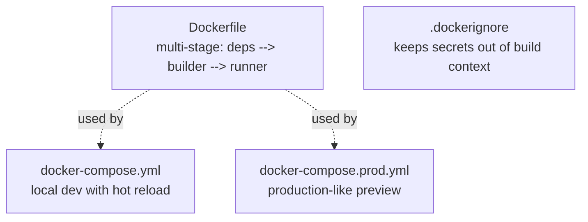
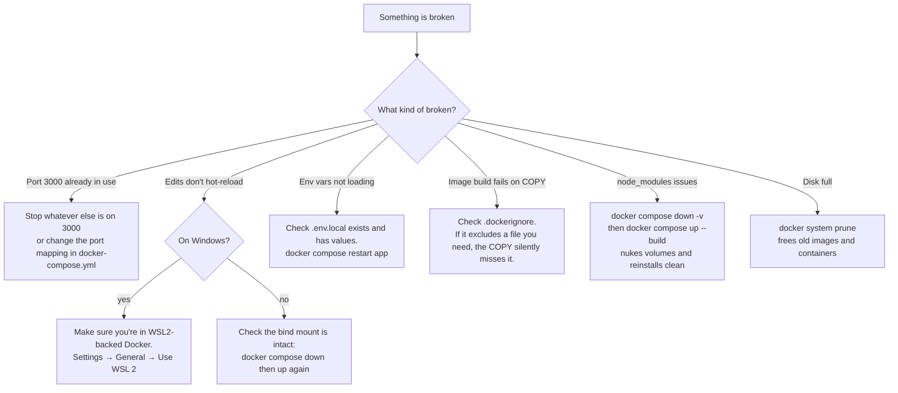

# DOCKER.md

Plain English: **Docker is a sealed box that contains the app and everything
it needs to run.** It guarantees the site behaves identically on your laptop,
on a colleague's machine, and on the eventual server — because all three are
running the *same* box, regardless of what's installed on the host.

You don't need Docker to develop on this site. `npm install && npm run dev`
works fine on bare Node 20. Docker is here for two situations:

1. **A clean dev environment** — no "works on my machine, breaks on theirs"
   surprises from differing Node minor versions or missing system libraries.
2. **Production preview** — the production Dockerfile is the same image that
   eventually gets shipped. Running it locally is the closest thing to
   testing the real production build.

---

## What's where



| File | Purpose |
|---|---|
| [Dockerfile](../Dockerfile) | Multi-stage build. Stage 1 installs deps, stage 2 runs `next build`, stage 3 is the minimal runner. |
| [docker-compose.yml](../docker-compose.yml) | Local dev. Mounts source from host so edits hot-reload. |
| [docker-compose.prod.yml](../docker-compose.prod.yml) | Production preview. No source mount, mirrors the eventual Vercel deploy. |
| [.dockerignore](../.dockerignore) | Keeps `node_modules`, `.next`, `.env*`, `.git`, etc. out of the build context — image stays small and secrets never bake in. |

---

## How the multi-stage Dockerfile works

```
                                          builds compiled app          ships only what's needed
   ┌───────────────────┐                ┌───────────────────┐         ┌────────────────────────┐
   │   Stage 1: deps   │ ─ node_modules → │  Stage 2: builder │ ── .next → │   Stage 3: runner       │
   │   npm ci          │                │  next build       │         │   node server.js          │
   │   ~1.5 GB         │                │  ~2 GB            │         │   ~150 MB (final image)   │
   └───────────────────┘                └───────────────────┘         └────────────────────────┘

         (stages 1 + 2 are thrown away — the final image is just stage 3)
```

| Stage | Why it's separate |
|---|---|
| **deps** | Cached as its own layer. If only source code changes (not `package.json`), Docker reuses this whole layer — no `npm install` re-run. |
| **builder** | Bigger because it has the full source tree + dev dependencies + `.next/` build output. Discarded after copying just the bits we need. |
| **runner** | Tiny. Has Node, `.next/standalone/server.js`, the static assets, and nothing else. Runs as a non-root user. |

---

## Local dev with Docker (hot reload)

```powershell
# Start in the foreground (logs stream to your terminal)
docker compose up

# Or detached, with a separate logs tail
docker compose up -d
docker compose logs -f app
```

What happens:

1. Compose builds the image, stopping at the `deps` stage (we don't need the
   full multi-stage build for dev).
2. Compose starts a container running `npx next dev --hostname 0.0.0.0 --port 3000`.
3. The host's project folder is bind-mounted to `/app` inside the container —
   so editing a file on your machine hot-reloads in the container.
4. `node_modules` and `.next` are on **named volumes**, not the host mount —
   that prevents Windows-compiled binaries from shadowing the container's
   Linux ones.

Visit http://localhost:3000.

To stop:

```powershell
docker compose down            # stops and removes containers
docker compose down -v         # also removes the named volumes (forces re-install on next up)
```

> 💡 **Tip:** `.env.local` is loaded at container start (via `env_file` in
> `docker-compose.yml`). Edit `.env.local`, then `docker compose restart app` —
> no rebuild needed.

---

## Production preview

For testing the actual production build locally:

```powershell
docker compose -f docker-compose.prod.yml up --build
```

This builds the *full* multi-stage image and runs the standalone server.
No source mount — it's frozen at build time, just like Vercel's deployment.

Visit http://localhost:3000.

> ⚠️ **The production preview won't hot-reload.** Editing files locally has
> no effect — you have to `docker compose -f docker-compose.prod.yml up --build`
> again. Use the dev compose for iteration; this one for verification.

---

## Command reference

| Command | What it does |
|---|---|
| `docker compose up` | Start dev containers in foreground |
| `docker compose up -d` | Start in background (detached) |
| `docker compose down` | Stop and remove containers |
| `docker compose down -v` | Stop, remove containers, **also remove volumes** (forces fresh `npm install`) |
| `docker compose logs -f app` | Tail logs from the `app` service |
| `docker compose restart app` | Restart the app container without a rebuild (picks up new env vars) |
| `docker compose ps` | List running services and their health |
| `docker compose build` | Rebuild the image (after Dockerfile changes) |
| `docker compose build --no-cache` | Force rebuild ignoring cache (use sparingly — slow) |
| `docker compose exec app sh` | Open a shell inside the running container |
| `docker compose -f docker-compose.prod.yml up --build` | Build and run the production preview |
| `docker system prune` | Free disk by removing unused images/containers (asks for confirmation) |

---

## Adding a new npm package

```powershell
# Install on the host (so package.json + lockfile update)
npm install some-new-package

# Rebuild the image so the container picks up the new dep
docker compose down
docker compose up --build
```

Why two steps: `npm install` updates `package.json` and `package-lock.json` on
the host. The container's named-volume `node_modules` doesn't see those changes
until you rebuild and re-mount.

> ⚠️ **Don't `docker compose exec app npm install`.** That installs into the
> volume but won't update `package.json` on the host — your lockfile drifts.

---

## Troubleshooting



### Specific issues

| Symptom | Cause | Fix |
|---|---|---|
| `Bind for 0.0.0.0:3000 failed: port is already allocated` | Another process is using port 3000 | Stop it, or change `ports` in `docker-compose.yml` to `3001:3000` |
| `npm ERR! ENOENT: no such file or directory, open '/app/package.json'` | The bind mount didn't attach correctly | `docker compose down -v && docker compose up --build` |
| Pages render but with no styling | Stale `.next` in the named volume | `docker compose down -v && docker compose up --build` |
| Container repeatedly restarts | Server crashed at boot, often missing env var | `docker compose logs -f app` to see the error |
| "permission denied" writing to `/app` on Linux hosts | Container user (1001) can't write to host-owned files | Uncomment the `user: "${UID:-1000}:${GID:-1000}"` line in `docker-compose.yml` |
| Build is dramatically slower than expected | `--no-cache` was used, or Docker can't reuse the deps layer | Avoid `--no-cache` unless debugging. Check that you didn't change `package.json` unnecessarily. |
| Production preview can't reach the internet (Resend, Sentry) | `.env.local` not propagated, or domain blocked by firewall | `docker compose -f docker-compose.prod.yml config` shows the resolved env. Verify keys are present. |

---

## Why .dockerignore and env_file are both correct

Common confusion: `.dockerignore` says "exclude `.env*`", but
`docker-compose.yml` has `env_file: .env.local`. That's not a contradiction.

| Mechanism | What it does | When |
|---|---|---|
| `.dockerignore` | Excludes files from the **build context** sent to the Docker daemon | At image **build** time |
| `env_file` in compose | Reads env vars from a host file at **container start** | At **runtime**, never bakes into the image |

Together: secrets stay on the host filesystem, never enter the image, but are
still available to the running container. This is the standard pattern.

---

## Full cleanup (when nothing else helps)

> ⚠️ **Destructive.** Removes ALL Docker resources on your machine, not just
> this project's.

```powershell
docker compose down -v
docker system prune -a --volumes
```

After this, the next `docker compose up --build` is a from-scratch download
and rebuild — slow (~10–15 min on a first run). Use only when convinced
something corrupted is the cause.
