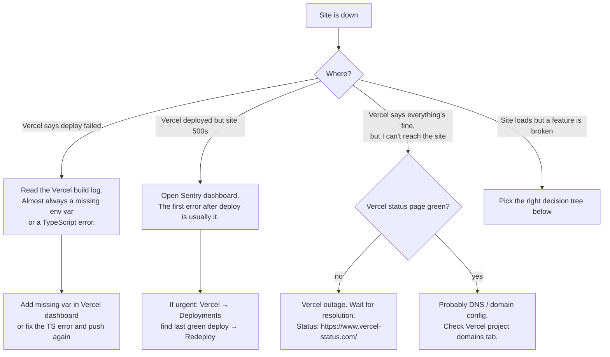
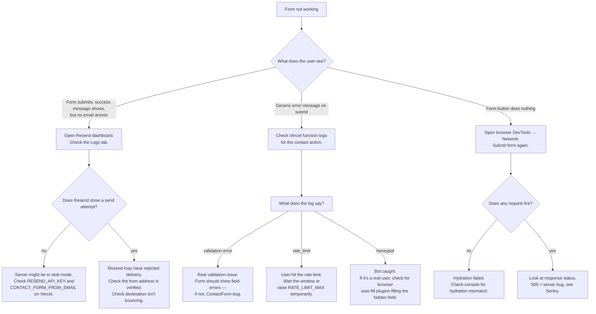
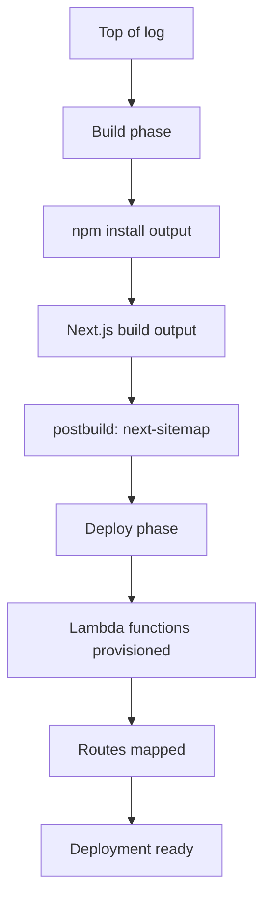
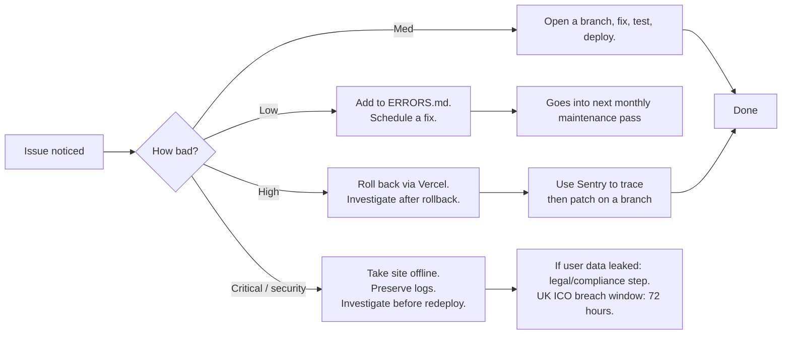

# ERRORS.md

Catalogue of every error pattern this project has hit (or is likely to hit) and
how to resolve it. Update this every time something new breaks and gets fixed —
that's how the file earns its keep.

> ℹ️ **Note:** When you encounter a new error, add a row to the table with
> the exact error message, the root cause, the fix, and date the entry.

---

## Decision tree — "the site is down"

---

## Decision tree — "contact form not working"

---

## Error catalogue

| # | Error message | File / location | Cause | Fix | Severity | Date logged |
|---|---|---|---|---|---|---|
| 1 | `Hydration failed because the initial UI does not match what was rendered on the server` | Often `CookieConsent.tsx` or any component using `localStorage` | Reading `localStorage` (or `window`, `document`) outside `useEffect` — server renders one thing, client renders another | Move every browser-only API call into a `useEffect`. Initial state should be SSR-safe (e.g. `null`, then update in effect) | High | 2026-04 |
| 2 | `Missing required env var(s): NEXT_PUBLIC_SITE_URL` (or others) | `lib/env.ts` at module load | Required env var unset; `next build` runs with `NODE_ENV=production` so validation fires | Add the var to `.env.local` (local) or to Vercel env vars (deploy). Empty string counts as missing — must have a value. | High | 2026-03 |
| 3 | `Refused to load the script 'https://...' because it violates the following Content Security Policy directive: ...` | Browser console | A new external script was added without updating CSP whitelist | Add the domain to the relevant directive in `next.config.ts` (`script-src` for JS, `connect-src` for fetch, etc.). Re-run the security-headers integration test. | High | 2026-03 |
| 4 | `Sentry SDK warning: No DSN configured, SDK will not send events` | Server logs at boot | `NEXT_PUBLIC_SENTRY_DSN` empty | Expected behaviour for the demo build. Set the DSN in Vercel when ready to flip monitoring on. | Low | 2026-03 |
| 5 | `Too many submissions — please wait a few minutes` shown on form | Visitor's view of the contact form | Rate limit triggered (default: 3 submissions per 10 min per IP) | Wait the window. For testing, raise `RATE_LIMIT_MAX` in `.env.local` then restart dev server. | Low | 2026-03 |
| 6 | `next-sitemap: NEXT_PUBLIC_SITE_URL is not defined; falling back to http://localhost:3000` | `npm run build` postbuild output | Env var missing during build | Set `NEXT_PUBLIC_SITE_URL` before building. The fallback prevents crash but produces a localhost-pointing sitemap that Google can't index. | Medium | 2026-03 |
| 7 | `Cannot find module '@/lib/env'` | Test run or build | Path alias misconfigured | Verify `tsconfig.json` `paths` and `jest.config.ts` `moduleNameMapper` agree (`"^@/(.*)$": "<rootDir>/$1"`) | Medium | 2026-02 |
| 8 | `ReferenceError: window is not defined` | Test run | A server-only test running in jsdom env, OR a client-only API used during SSR | For tests: add `@jest-environment node` docblock. For runtime: move browser API into `useEffect` or check `typeof window !== "undefined"` first. | Medium | 2026-03 |
| 9 | `Bind for 0.0.0.0:3000 failed: port is already allocated` | `docker compose up` | Port 3000 in use by another process | Stop the other process, or change the port mapping in `docker-compose.yml` to e.g. `3001:3000` | Low | 2026-03 |
| 10 | `Could not find Component module: ...` after running `next build` then `npm test` | Test suite | Jest's haste-map sees both root `package.json` and `.next/standalone/package.json` | Already fixed by `modulePathIgnorePatterns: ["<rootDir>/.next/"]` in `jest.config.ts`. If it still appears, run `Remove-Item -Recurse -Force .next` and re-run tests. | Medium | 2026-02 |
| 11 | Unstyled site after Tailwind v4 upgrade | Browser | Stale `.next/` from a Tailwind v3 build | `Remove-Item -Recurse -Force .next; npm run dev` | Medium | 2026-02 |
| 12 | Framer Motion components fail axe-core contrast check | Test run | Mid-animation `opacity:0` elements scanned as low-contrast text | Already fixed by `matchMedia` mock in `jest.setup.ts` returning `matches: true` for `prefers-reduced-motion`. If it returns: confirm the mock didn't get overwritten by another test. | High | 2026-04 |
| 13 | `Failed to compile: Module not found: Can't resolve 'fs'` | `next build` | A server-only module imported into a client component (`'use client'` file) | Either move the logic to a server component or wrap in dynamic import: `const fs = require('fs')` inside an event handler that only runs server-side | High | (potential) |
| 14 | GitHub Dependabot: 1 moderate (`postcss` inside Next bundled deps) | GitHub Security tab | Transitive dep inside Next.js. Master prompt's audit gate is "high or critical only". | Documented and tracked. No action — Next will roll a patch in due course. | Low | 2026-04 |
| 15 | `EPERM: operation not permitted, mkdir` on Windows | `npm install` | OneDrive / Windows Defender / antivirus locking the folder | Add the project folder to OneDrive's "always available" or to Defender's exclusion list. Or move the project off OneDrive entirely. | Medium | 2026-02 |
| 16 | "© year" footer flagged by axe `region` rule | Test run (smoke / accessibility) | axe expects every text element to live inside a landmark | Already fixed by disabling `region` rule in `tests/smoke/accessibility.test.tsx` — well-landmarked pages don't need the sub-bar wrapped | Low | 2026-05 |
| 17 | LF/CRLF line ending warnings on every git operation on Windows | `git add` / `git commit` | `core.autocrlf` setting differs from repo's checked-in line endings | Non-blocking — just noisy. To silence: `git config core.autocrlf input` (Linux/macOS) or `true` (Windows) | Low | 2026-04 |
| 18 | `LOCAL_HTTP_TEST` doesn't disable HTTPS upgrade after env var change | Mobile testing | Env var only read at server boot; rebuild needed | Stop the standalone server, set `$env:LOCAL_HTTP_TEST="1"`, run `npm run build`, then start the server again | Low | 2026-04 |

---

## How to read a Sentry error report

When Sentry catches an error, the dashboard view has these sections:

| Section | What it shows | What to do with it |
|---|---|---|
| **Title** | Error class + first line of message | Quickly identify whether it's a known issue |
| **Tags** | Browser, OS, URL, release | Filter by tag — e.g. "all errors on /privacy-policy" |
| **Stack trace** | The function call chain that led to the throw | Top frame is usually where the error fires; second frame upward is usually the actual bug |
| **Breadcrumbs** | The user's actions in the seconds before the error | Reproduces the user's path — clicks, navigations, fetches |
| **User context** | IP-derived location, browser fingerprint | Confirm whether this is one user or many |
| **Source map link** | Click a stack frame → see original TypeScript source | Only works if `SENTRY_AUTH_TOKEN` is set in Vercel and `silent: false` in `next.config.ts`. Otherwise frames show minified JS. |

> 💡 **Tip:** "Issues" in Sentry are grouped — the same error from 1,000 users
> appears as one issue with `events: 1000`. Don't mistake event count for
> issue count.

---

## How to read a Vercel deployment log

Where errors usually appear:

| Failure phase | Symptom | Most common cause |
|---|---|---|
| `npm install` | Package resolution error | Lockfile drift — run `npm install` locally, commit the lockfile |
| Next build | TypeScript error | Code that compiled locally must compile in CI too — verify with `npx tsc --noEmit` |
| Next build | Missing env var | Add it in Vercel dashboard; redeploy |
| Next build | "Module not found" | Path alias drift between `tsconfig.json` and how the code imports it |
| Postbuild (next-sitemap) | Crashes only if `NEXT_PUBLIC_SITE_URL` is unset — has a fallback so usually warns instead | (warning, not error) |
| Deploy | Function size > Vercel limit | Too many dependencies bundled into a server route. Audit `next/dynamic` usage. |

---

## Escalation path

| Severity | Examples | Response time |
|---|---|---|
| **Low** | Cosmetic bug, minor copy issue, warning in console | Next maintenance pass |
| **Medium** | One feature broken (form, link), partial 500s | Fix and deploy within 24 hours |
| **High** | Site down, all forms failing, leaked PII | Roll back immediately, then fix |
| **Critical / security** | Active exploit, data breach, unauthorised admin access | Take offline, preserve logs, **do not delete anything**, escalate to client + (if user data) legal |

> 🚨 **Critical:** if the site is compromised and user data is involved, the
> UK Information Commissioner's Office requires breach notification within
> **72 hours**. Don't wipe logs to "clean up" — that destroys evidence.
> Preserve everything, copy off-site, then investigate.
