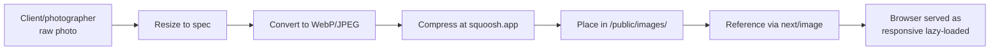
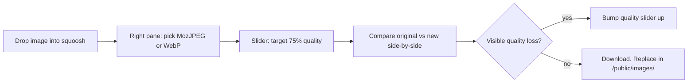

# IMAGES.md

Every image the site needs, where it appears, and the specs to send.
Photographers and the eventual client should be able to read this and
hand back files that drop in cleanly.

---

## Image pipeline



> 💡 **Tip:** Send raw photos as JPG or PNG, as large as the device captured
> them. The developer handles resizing and compression. **Don't** pre-compress
> aggressively before sending — it can't be un-compressed.

---

## Where images live

All site images live under `public/images/`. Sub-folders by section:

```
public/images/
├── hero-interior.jpeg          Hero slide 1
├── hero-pastries.jpeg          Hero slide 2
├── hero-shopfront.jpeg         Hero slide 3
├── story-1.jpeg, story-2.jpeg, story-3.jpeg, story.jpeg   Story section
├── bench-cardamom.jpeg, bench-flatwhite.jpeg, bench-matcha.jpeg, bench-sourdough.jpeg
│                              Today's Bench cards
├── menu/
│   ├── bakery.jpeg, pastries.jpeg, kitchen.jpeg, hjemmade.jpeg
│   ├── coffee.jpeg, matcha.jpeg     (drinks cards — currently unused)
└── testimonials/
    ├── avatar-feldman.jpeg, avatar-karen.jpeg, avatar-sarah.jpeg
```

---

## Full image inventory

| Filename | Section | Where it appears | Dimensions (target) | Format | Max size | Alt text suggestion |
|---|---|---|---|---|---|---|
| `hero-interior.jpeg` | Hero | Slide 1 (loaded with `priority`) | 1920×1280 | JPEG | 250 KB | "Warm interior of Hjem Kensington at golden hour with stone-milled sourdough loaves and cardamom buns on a wooden counter" |
| `hero-pastries.jpeg` | Hero | Slide 2 | 1920×1280 | JPEG | 250 KB | "Overhead view of cardamom buns and a half-cut sourdough loaf on cream linen, warm side-light" |
| `hero-shopfront.jpeg` | Hero | Slide 3 | 1920×1280 | JPEG | 250 KB | "Hjem shopfront on Gloucester Road at blue hour with warm interior glow and rosemary planters by the door" |
| `story-1.jpeg`, `story-2.jpeg`, `story-3.jpeg` | Story | Image grid | 800×1000 each | JPEG | 150 KB each | Specific to each photo (the baker's hands, the oven, finished loaves, etc.) |
| `story.jpeg` | Story | Currently unused — kept for future variant | 1600×1000 | JPEG | 220 KB | (n/a) |
| `bench-cardamom.jpeg` | Today's Bench | Card 1 | 800×800 | JPEG | 120 KB | "Three cardamom buns on parchment, freshly glazed" |
| `bench-flatwhite.jpeg` | Today's Bench | Card 2 | 800×800 | JPEG | 120 KB | "Flat white in a stoneware cup, latte art on top" |
| `bench-matcha.jpeg` | Today's Bench | Card 3 | 800×800 | JPEG | 120 KB | "Whisked matcha in a ceramic bowl, bright green foam" |
| `bench-sourdough.jpeg` | Today's Bench | Card 4 | 800×800 | JPEG | 120 KB | "Sourdough loaf with deep ear scoring, fresh from the oven" |
| `menu/bakery.jpeg` | Menu | Carousel slide | 1200×800 | JPEG | 180 KB | "Bakery counter with sourdough, rye, and seeded loaves on display" |
| `menu/pastries.jpeg` | Menu | Carousel slide | 1200×800 | JPEG | 180 KB | "Tray of cardamom buns and Danish pastries fresh from the oven" |
| `menu/kitchen.jpeg` | Menu | Carousel slide | 1200×800 | JPEG | 180 KB | "Hjem's kitchen mid-bake, hands shaping dough on a flour-dusted bench" |
| `menu/hjemmade.jpeg` | Menu | Carousel slide | 1200×800 | JPEG | 180 KB | "Hjemmade selection — sandwiches and salads on the counter" |
| `menu/coffee.jpeg` | Menu | (unused — drinks card pending) | 1200×800 | JPEG | 180 KB | "Single origin pour-over coffee, half-poured into a mug" |
| `menu/matcha.jpeg` | Menu | (unused — drinks card pending) | 1200×800 | JPEG | 180 KB | "Iced matcha latte in a tall glass, milk poured in a swirl" |
| `testimonials/avatar-feldman.jpeg` | Testimonials | Card 1 | 200×200 | JPEG | 30 KB | "Headshot of customer Sarah F." (or similar) |
| `testimonials/avatar-karen.jpeg` | Testimonials | Card 2 | 200×200 | JPEG | 30 KB | "Headshot of customer Karen M." |
| `testimonials/avatar-sarah.jpeg` | Testimonials | Card 3 | 200×200 | JPEG | 30 KB | "Headshot of customer Sarah B." |

> ⚠️ **The testimonial avatars are currently ~9MB each.** They render fine
> via `next/image` (which serves an optimised version) but the source files
> bloat the repo. Compress to ~30 KB at squoosh.app before client launch.
> Tracked as a known issue in [ERRORS.md](ERRORS.md).

---

## Open Graph image

Required for social previews (Twitter/X, LinkedIn, WhatsApp, iMessage, etc.)

| Property | Value |
|---|---|
| Filename | `og-image.png` (to be added) |
| Dimensions | **1200×630** — required by all major platforms |
| Format | PNG or JPEG — PNG for crisp text, JPEG if it's a photograph |
| Max size | 1 MB (most platforms reject larger) |
| Content | Hjem wordmark + a strong photo, with the tagline visible |
| Where referenced | `app/layout.tsx` `metadata.openGraph.images` |

> 💡 **Why exactly 1200×630:** that's the aspect ratio (~1.91:1) Twitter
> Card large image and Facebook OG both expect. Smaller = pixelated previews,
> wrong aspect = cropped previews.

OG image isn't in the repo yet — flagged for client onboarding.

---

## Favicon set

| File | Size | Purpose | Where referenced |
|---|---|---|---|
| `favicon.ico` | 32×32 (multi-res) | Browser tab icon, fallback | `app/favicon.ico` (Next auto-detects) |
| `apple-touch-icon.png` | 180×180 | iOS home screen | `app/apple-touch-icon.png` |
| `icon-192.png` | 192×192 | Android home screen / PWA | `app/icon.png` |
| `icon-512.png` | 512×512 | High-DPI Android, PWA splash | `app/icon.png` (Next renders multiple sizes from one source) |

> 💡 **Tip:** generate the full set from one 1024×1024 source PNG using
> https://realfavicongenerator.net — the free tool produces every size
> and the `manifest.json` you'd want for PWA support.

Favicons aren't generated yet — flagged for client onboarding.

---

## Why we use Next.js `<Image>` instead of ``

| Behaviour | `<Image>` | `` |
|---|---|---|
| Lazy loading | yes by default (except `priority` images) | no — every image loads on first paint |
| Responsive `srcset` | auto-generated from `sizes` prop | none |
| Format conversion | serves WebP/AVIF if browser supports | serves whatever is on disk |
| Layout shift prevention | requires `width`+`height` or `fill` — reserves space | none |
| `loading="lazy"` browser hint | yes | no (unless added manually) |
| Built-in placeholder blur | optional via `placeholder="blur"` | none |

A single hero image `` tag costs ~700ms more LCP than a properly-tuned
`<Image>` on a 4G connection. Across 7 sections of homepage imagery, that's
the difference between Lighthouse 90+ and Lighthouse 70.

> ⚠️ **Don't use `` even for "just one quick" image.** Once one bypasses
> the discipline, others follow.

---

## Photographer brief (send to whoever's shooting)

```
Hjem Kensington — image brief

Style: warm, hand-crafted, neighbourhood. Side-light over hard top-light.
       Cream / moss / clay palette in the scene where possible.
       People welcome (staff, customers from behind/at angles) — but the
       focus is product and place.

Required shots (target: 14 images):
  3 × hero (interior, pastries, shopfront) — 1920×1280, landscape
  3 × story panels — 800×1000, portrait
  4 × today's bench (cardamom, flat white, matcha, sourdough) — 800×800, square
  4 × menu carousel (bakery, pastries, kitchen, sandwich/salad) — 1200×800

Optional:
  + drinks shots (coffee, matcha) for when drinks list is available
  + testimonial avatars if customers consent

Deliverables:
  - Original RAW or full-resolution JPEG/PNG. We compress on our end.
  - Hi-res version of one strong "OG" image (1200×630-ish framing).

Avoid:
  - heavy filters / preset looks
  - portrait-orientation shots where landscape is asked
  - shots with prominent third-party trademarks (e.g. competitor brand
    visible in background)
```

---

## Compression with squoosh.app

Free in-browser tool — https://squoosh.app — that compresses images without
uploading them to a third-party server.



| Format | When |
|---|---|
| **WebP** | Default — better compression than JPEG, supported everywhere except IE11 (we don't support IE11) |
| **MozJPEG** | If a photograph and the WebP-vs-MozJPEG side-by-side shows MozJPEG winning |
| **PNG** | Logos, icons, anything with transparency or sharp edges |
| **AVIF** | Best compression, but encoder is slow and tooling rougher than WebP. Worth it for hero imagery if file size matters more than 5-minute encode time. |

Save filenames lowercase, hyphenated, no spaces.

---

## Client-side instructions (plain English, for the business owner)

> Send your photos as JPG or PNG, as large as your phone or camera can take.
> We resize and compress on our end. **Don't crop or "improve" them in
> Instagram first** — that costs us quality we can't get back.
>
> Easiest way to send:
>
> - **AirDrop / iCloud Drive** if you're on iPhone — pick "Original size"
> - **Google Photos** with the "Download original" option
> - **WeTransfer** for batches — free for up to 2 GB
>
> If a photo is over 25 MB, that's normal. We'd rather have too much detail
> than too little.
