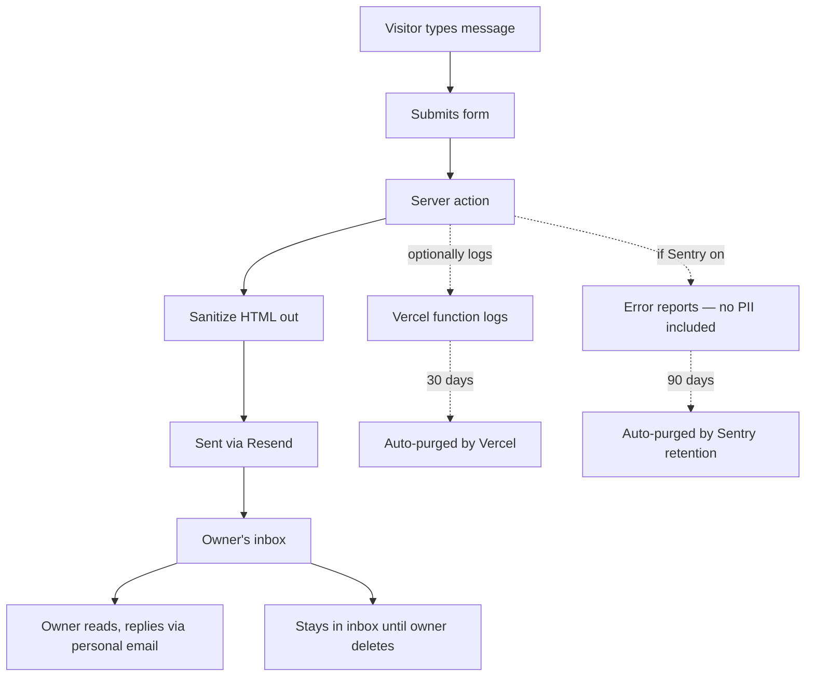
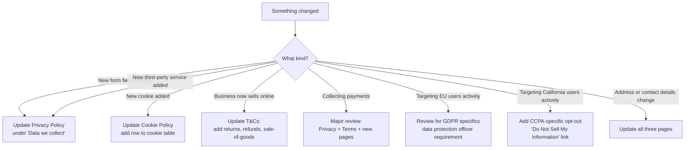

# LEGAL.md

> 🚨 **Critical — read first.**
> The legal pages on this site (Privacy Policy, Terms & Conditions, Cookie
> Policy) are **AI-generated templates** seeded with realistic UK content but
> **not reviewed by a qualified solicitor**. They MUST be reviewed and
> approved by a UK solicitor specialising in privacy and consumer law before
> the site goes live to the public. The developer (Essam Noureldin) accepts
> no liability for their legal compliance, accuracy, or completeness.
>
> The Hjem owner (or whichever client buys this build) is responsible for
> commissioning legal review before launch.

---

## What's on the site

| Page | URL | Jurisdiction | Law areas covered | Last updated |
|---|---|---|---|---|
| Privacy Policy | `/privacy-policy` | UK (England & Wales) | UK GDPR, Data Protection Act 2018, PECR | 2026-04 (last code change) |
| Terms & Conditions | `/terms-and-conditions` | UK (England & Wales) | Consumer Rights Act 2015, limitation of liability, IP, governing law | 2026-04 |
| Cookie Policy | `/cookie-policy` | UK (England & Wales) | PECR, cookie classifications | 2026-04 |

All three are linked from the Footer on every page.

---

## What each page covers

### Privacy Policy

| Section | Plain English |
|---|---|
| Data we collect | Name, email, phone (if given), and message contents from the contact form |
| Why we collect it | To respond to enquiries — that's it |
| Cookies disclosed | Strictly necessary (session) + analytics (GA4, only with consent) |
| Third parties | Resend (email delivery), Sentry (error monitoring), Vercel (hosting), Google Analytics (if user consents) |
| User rights under UK GDPR | Right to access, rectify, erase, restrict, object, port |
| Data retention | Contact form submissions: 24 months in inbox unless deleted by recipient |
| Contact for data requests | The address in `CONTACT_FORM_TO_EMAIL` |
| Last updated | Auto-rendered from page-level metadata |

### Terms & Conditions

| Section | Plain English |
|---|---|
| Nature of business | Bakery and coffee shop. Site is informational. No goods sold online. |
| Limitation of liability | Site provided as-is. Hjem not liable for damages from reliance on site content. |
| Intellectual property | All content (text, images, logo) is Hjem's. No reproduction without permission. |
| Governing law | England & Wales. Disputes resolved in courts of England & Wales. |
| No warranty | Information believed accurate but not guaranteed. Hours, prices, availability subject to change. |
| Contact for disputes | Same email as data requests |

### Cookie Policy

| Cookie type | Used? | Purpose | How to opt out |
|---|---|---|---|
| Strictly necessary | yes | Session continuity, security, consent storage | Cannot be disabled (the site doesn't work without them) |
| Analytics (GA4) | only with consent | Usage statistics, page views | Decline at the cookie banner, or clear `cookie_consent` from localStorage |
| Functional | no | n/a | n/a |
| Marketing / advertising | no | n/a | n/a |

The Cookie Policy links back to the Privacy Policy and explains how to
withdraw consent (clear localStorage, or use the browser's site-data clear).

---

## Data flow — what happens to a contact form submission

| Datum | Where it lives | Retention |
|---|---|---|
| Submission body (sanitized) | Owner's email inbox | Indefinite — owner controls |
| Submission timestamp + IP hash | In-memory rate limit map | TTL: 10 minutes (then dropped) |
| Vercel function logs (containing the request) | Vercel | 30 days (free tier) |
| Sentry error reports (PII-stripped) | Sentry | 90 days |

The site never writes the submission to a database, never persists IP
addresses, never sets a tracking cookie pre-consent.

---

## Triggers that require a legal page update

| Trigger | Pages affected | Priority |
|---|---|---|
| New contact form field | Privacy Policy | High |
| Add Mailchimp / newsletter | Privacy + Cookie + new consent | High |
| Add online ordering | Terms + Privacy + new payment page | Critical |
| Add Google Maps | Cookie Policy (Maps cookies) + CSP update | High |
| New third-party (chatbot, reviews widget) | Privacy + Cookie | High |
| Business name / contact change | All three pages + Footer + Contact section | Medium |
| Annual review trigger | All three | Medium |

---

## Review schedule

| Cadence | What | Who |
|---|---|---|
| **Annually** | Full re-read of all three pages, update dates, refresh on any law changes | Owner + solicitor |
| **On any trigger** (table above) | Targeted update | Owner + developer |
| **Pre-launch** | Solicitor review (non-negotiable before public launch) | Owner-engaged solicitor |

> 🚨 **Critical:** the speculative demo build doesn't yet have solicitor
> review. The pages exist as a starting point for the conversation. The owner
> who buys this build must commission their own review before relying on
> them.

---

## Where to find a solicitor

Don't take a recommendation here — solicitor selection is a personal /
business decision. General guidance:

| Resource | Use it for |
|---|---|
| **The Law Society** (UK) | Find Solicitors directory at https://www.lawsociety.org.uk/ — filter by "Data Protection" or "Privacy" |
| Local solicitor search | Many small West London firms have privacy/compliance practices |
| **Nominet / Legal500** | For larger / more complex sites |
| **Legal Aid** | Not applicable — business law is generally not legal-aid eligible |

> ⚠️ **Don't engage a "DIY legal" template service** for a business that
> handles customer enquiries. Templates are how this codebase already drafted
> the pages — paying for a slightly-better template doesn't add the human
> review that's the whole point.

---

## What to bring to a solicitor review

| Document | Source |
|---|---|
| The three drafted pages | https://[live-url]/privacy-policy etc. |
| The data-flow diagram above | This document |
| Description of the business | "Small bakery + coffee shop in Kensington, no online sales, contact form is the only data-collecting interaction" |
| List of third parties | Resend, Sentry (when on), Vercel, GA4 (when on) |
| Cookie inventory | Cookie Policy table |
| Any future plans | Online ordering? Email newsletter? Loyalty programme? |

A solicitor without context will charge for time spent figuring out the
business. Bring the picture pre-assembled.

---

## Disclaimers (read carefully)

> 🚨 **The legal pages were generated by AI and reviewed by a developer, not
> a lawyer.** Plausibility and structural completeness are not legal sufficiency.
>
> 🚨 **The developer (Essam Noureldin) is not a solicitor and gives no legal
> advice in this document or anywhere else in this codebase.** Comments,
> design choices, and architectural defaults reflect engineering judgment
> about reasonable defaults — they are not legal opinions.
>
> 🚨 **Data protection law evolves.** UK GDPR, the Data Protection Act 2018,
> and PECR have been amended multiple times since 2018. The drafted pages
> may not reflect the most recent guidance from the ICO. Annual review is
> the minimum bar.
>
> 🚨 **Jurisdictional reach.** The pages are drafted for a UK business
> serving primarily UK visitors. If Hjem actively markets to or serves
> visitors in other jurisdictions (EU, US, Canada, Australia), additional
> compliance work may be required.

If reading these disclaimers is the only thing this document does, it's done
its job.
