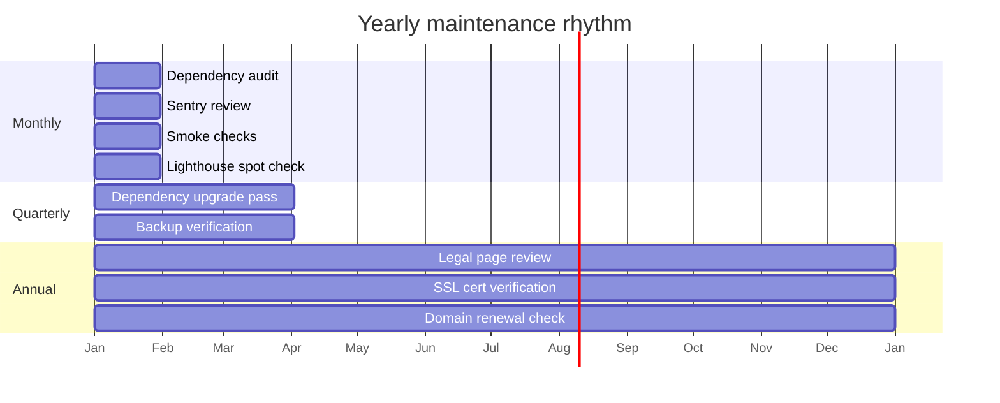
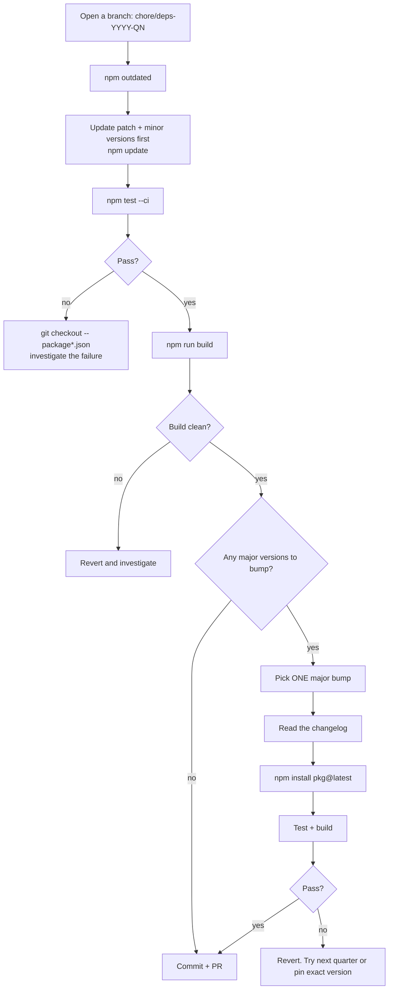
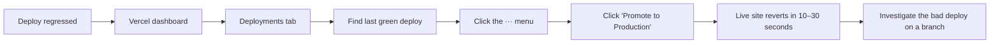
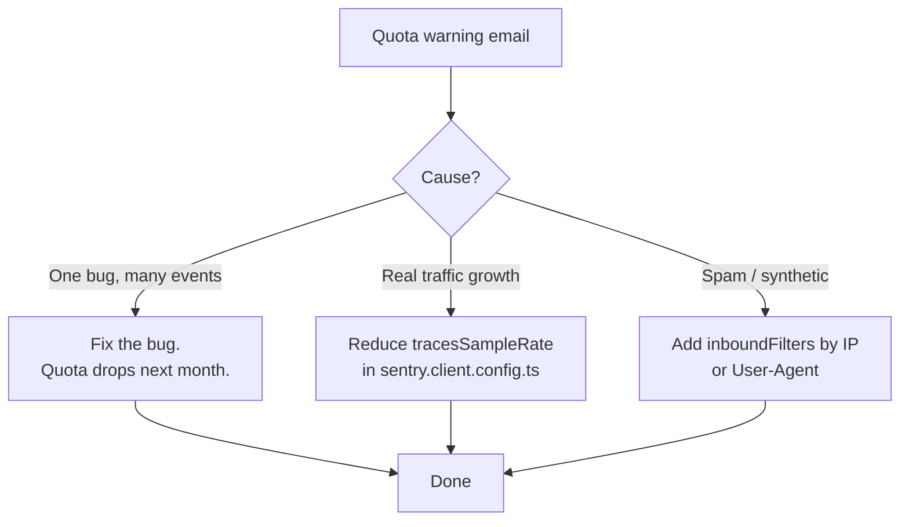

# MAINTENANCE.md

What to do, how often, to keep the site healthy. The site doesn't need much
attention — but the small amount it needs, it needs reliably.

> 💡 **Tip:** Block one hour at the start of each month for the monthly
> checklist. Doing it on a schedule beats chasing it after something breaks.

---

## Maintenance calendar



---

## Monthly checklist

Block ~1 hour. Run through every box. Mark each done.

```
□ npm audit --audit-level=high   → fix any high/critical vulnerabilities
□ npm outdated                    → note packages with major updates available
□ Submit a real test contact form on the live URL → verify email arrives
□ Open Sentry dashboard           → resolve any new errors logged this month
□ Check Vercel deployment logs    → confirm no warnings in the latest deploy
□ Open the live site on a real phone (mobile viewport, real network)
   □ Hero image loads quickly
   □ Cookie banner appears
   □ Accept cookies → GA appears in Network tab
   □ All footer links resolve (no 404s)
   □ Contact form submits successfully
□ Run Lighthouse in incognito on the homepage
   □ Performance ≥ 90
   □ Accessibility ≥ 95
   □ SEO ≥ 95
   □ Best Practices ≥ 95
□ Check SSL certificate         → must have ≥ 90 days remaining
   (Vercel auto-renews — but verify monthly)
□ Review form-submission logs   → look for spam patterns or odd IPs
□ Confirm sitemap.xml current    → visit /sitemap.xml, verify lastmod dates
```

---

## Quarterly: dependency upgrade pass



> ⚠️ **One major bump at a time.** Stacking three majors in a single PR
> means three different things can break at once. Land them sequentially.

---

## Annual tasks

| Task | Why | Estimated time | Notes |
|---|---|---|---|
| Legal page review | Privacy/Terms/Cookie content drifts as law evolves and the business changes | 1 hour reading + solicitor cost | See [LEGAL.md](LEGAL.md). Solicitor review is non-negotiable. |
| Update copyright year | Footer auto-renders `new Date().getFullYear()` — but verify on live site | 5 min | Vercel rebuilds keep it fresh; static export would freeze it |
| SSL certificate verification | Vercel auto-renews, but a manual check is cheap | 5 min | Visit the site, click the padlock, check expiry |
| Domain renewal | Most registrars auto-renew if billing is set up; verify | 5 min | If domain expires, the site becomes unreachable |
| `MAINTENANCE.md` review | This very document — does the rhythm still match the business? | 15 min | Add tasks that turned out to matter; remove ones that didn't |
| Lighthouse + Web Vitals deep dive | Catch slow drift in performance | 30 min | See [PERFORMANCE.md](PERFORMANCE.md) |
| Image audit | New offerings? Old products dropped? | 30 min + image work | See [IMAGES.md](IMAGES.md) |

---

## Updating dependencies — the safe loop

```powershell
# 1. New branch
git checkout -b chore/deps-YYYY-MM

# 2. See what's available
npm outdated

# 3. Patch + minor first (safe)
npm update

# 4. Test
npm run typecheck
npx eslint . --max-warnings 0
npx jest --ci --passWithNoTests
npm run build

# 5. If anything fails: revert, investigate
git checkout -- package.json package-lock.json
git clean -fd node_modules
npm install
```

For majors, bump one at a time, read the changelog, expect breaking changes.

---

## Vercel rollback (when a deploy regresses)



Vercel keeps every deployment indefinitely on hobby plans — there's no
"window" beyond which rollback isn't possible. Promotion is instant.

---

## Backups

The brochure site itself doesn't have user data to back up — there's no
database. What needs backing up:

| Asset | Where it lives | Backup |
|---|---|---|
| Source code | GitHub | GitHub *is* the backup. Confirm pushes land. |
| Domain registration | Whichever registrar | Verify auto-renewal annually. Note expiry in calendar. |
| Vercel config (env vars) | Vercel dashboard | Quarterly: export the env var list manually as a sanity check (settings → environment variables → copy values to a local password manager) |
| Resend API keys | Resend dashboard | Stored in Vercel env. If lost, regenerate in Resend dashboard. |
| Sentry config | Sentry dashboard | The DSN is in Vercel env. The org/project itself: tied to Essam's Sentry login. |
| Brand image originals | Local + cloud (Drive/Dropbox) | Confirm cloud sync is active. Photographer source files separate from the squoosh-compressed web copies. |

---

## Health-check commands (run any time)

```powershell
npx tsc --noEmit                     # TypeScript clean?
npx eslint . --max-warnings 0        # Lint clean?
npx jest --ci --passWithNoTests      # All tests pass?
npm run build                        # Production build succeeds?
npm audit --audit-level=high         # No high/critical vulns?
```

All five should exit with code 0. If any fail, fix that before doing anything
else — running on a broken baseline corrupts every subsequent change.

---

## Sentry quota awareness

The free tier has monthly event limits. If a bug fires on every page load, it
chews through quota fast.



---

## Escalation contacts

| Issue | Contact |
|---|---|
| Site down (suspected Vercel outage) | https://www.vercel-status.com/ |
| Email delivery failing | Resend dashboard → Logs |
| Domain / DNS | Domain registrar's support |
| Suspected security breach | (See [ERRORS.md](ERRORS.md) escalation tree) |
| Legal page concerns | UK solicitor specialising in privacy/data — see [LEGAL.md](LEGAL.md) |

---

## What "healthy" looks like

| Indicator | Healthy |
|---|---|
| Latest Vercel deploy | Green within last 30 days |
| `npm audit --audit-level=high` | 0 issues |
| Sentry — issues this month | < 5, all resolved |
| Lighthouse Performance | ≥ 90 |
| Lighthouse Accessibility | ≥ 95 |
| Manual contact-form test | Submits + email arrives within 30 seconds |
| SSL certificate days remaining | ≥ 90 |
| Test suite | All passing |
| Coverage | ≥ 80% across statements / branches / functions / lines |
