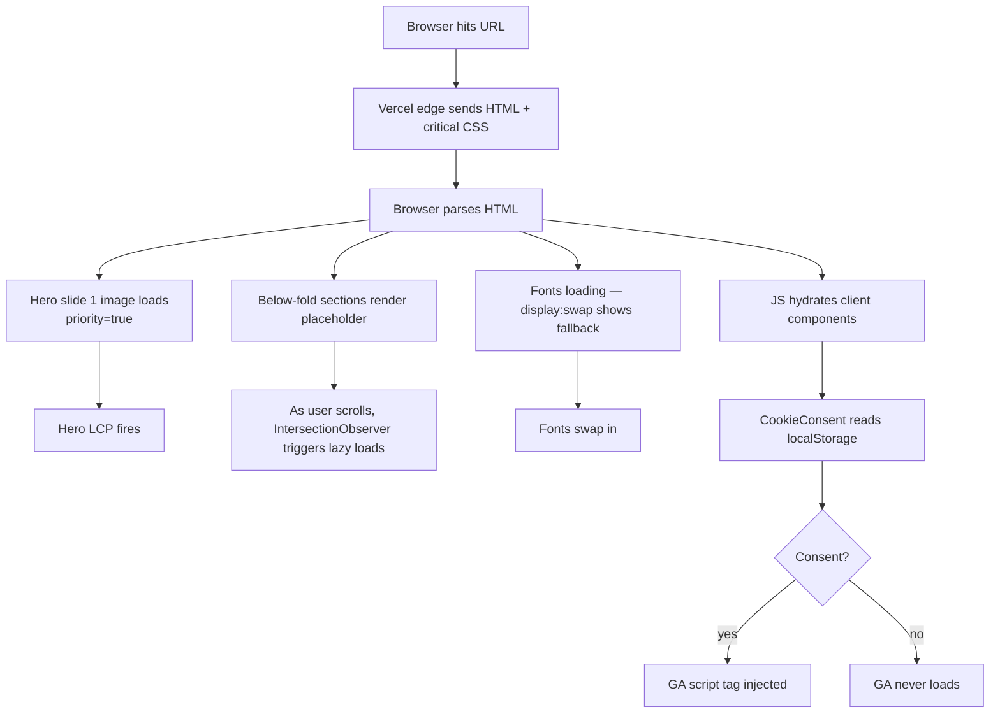
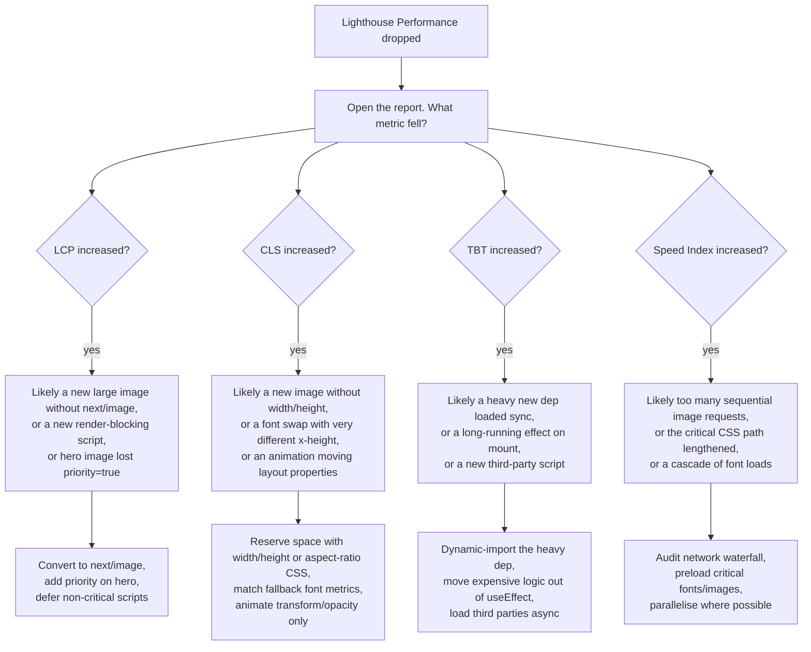

# PERFORMANCE.md

Performance targets, Core Web Vitals, and what was done to hit them. Read
this before "optimising" — most of the easy wins are already in.

---

## Targets

| Metric | Target | Why |
|---|---|---|
| Lighthouse Performance | ≥ 90 | The threshold above which Google's ranking signals stop penalising |
| Lighthouse Accessibility | ≥ 95 | Covers most semantic and ARIA issues; lower means a real user is excluded |
| Lighthouse SEO | ≥ 95 | Title, description, mobile-friendly, structured data — table stakes |
| Lighthouse Best Practices | ≥ 95 | HTTPS, no console errors, no deprecated APIs |
| LCP (Largest Contentful Paint) | < 2.5s | Google "good" threshold |
| INP (Interaction to Next Paint) | < 200ms | Replaced FID in 2024 — interaction lag |
| CLS (Cumulative Layout Shift) | < 0.1 | How much layout jumps during load |
| First Contentful Paint | < 1.8s | When *something* appears on screen |
| Total Blocking Time | < 200ms | Main-thread block time |
| Speed Index | < 3.4s | How quickly the page visually fills |

> ℹ️ **Note:** Lighthouse scores haven't been formally captured yet. They'll
> be measured against the deployed Vercel preview as part of the pre-launch
> checklist (Step 22). When that happens, fill in the actuals below.

```
Lighthouse run — pending, fill in pre-launch:

| Metric | Target | Actual | Status |
|---|---|---|---|
| Performance | ≥90 | __ | __ |
| Accessibility | ≥95 | __ | __ |
| SEO | ≥95 | __ | __ |
| Best Practices | ≥95 | __ | __ |
| LCP | <2.5s | __ | __ |
| INP | <200ms | __ | __ |
| CLS | <0.1 | __ | __ |
```

---

## Page load sequence



The sequence is tuned for "first paint feels fast" rather than "fully loaded
fast." Hero image is `priority`; everything below the fold is lazy.

---

## What's lazy-loaded

| Asset | Why | How |
|---|---|---|
| Hero slides 2 + 3 | Below the fold initially | Default `next/image` lazy |
| Story / Today's Bench / Menu / Testimonials / Visit images | Below fold | Default lazy |
| Testimonial avatars | Tiny but still off-screen on initial paint | Default lazy |
| GA4 script tag | Only loaded after consent | `GAScript` listens for `cookie-consent-accepted` event |
| Sentry SDK | Doesn't block first paint | `instrumentation-client.ts` async-loads |
| Embla autoplay plugin | Not needed for static initial render | Bundled with Hero, but Hero is a client component so it loads after hydration |

| Asset | Why NOT lazy |
|---|---|
| Hero slide 1 | Largest paint — needs to be eagerly loaded to keep LCP < 2.5s |
| Fraunces + DM Sans | Display fonts — `display: swap` shows fallback during load, swaps in seamlessly |
| `next/font` self-hosted assets | Inlined in CSS, no separate request |

---

## Font loading strategy

We use `next/font/google` for both Fraunces and DM Sans. This:

1. **Downloads the font at build time** (not at runtime)
2. **Serves it from `/_next/static/`** (same origin, cached forever)
3. **Inlines a `<style>` tag with `@font-face`** in the initial HTML
4. **Sets `display: swap`** — browser renders fallback text immediately and
   swaps to the real font once it loads

The result:

- Zero runtime requests to Google Fonts
- Tighter CSP (no `fonts.googleapis.com` whitelist needed)
- No FOIT (flash of invisible text) — only FOUT (flash of unstyled text)
- Visitor IP never leaves our origin

```typescript
// app/layout.tsx
import { Fraunces, DM_Sans } from "next/font/google";

const fraunces = Fraunces({
  variable: "--font-display-loaded",
  subsets: ["latin"],
  display: "swap",
  axes: ["SOFT", "opsz"],
});
```

---

## Animation rule

> 💡 **Animate transform and opacity. Never animate `top`, `left`, `width`, `height`.**

| Property | Triggers what | Cost |
|---|---|---|
| `transform: translate / scale / rotate` | Compositor only | Cheap (GPU) |
| `opacity` | Compositor only | Cheap (GPU) |
| `top` / `left` / `right` / `bottom` | Layout + paint + composite | Expensive — pushes other content around |
| `width` / `height` | Layout + paint + composite | Expensive — same |
| `padding` / `margin` | Layout + paint + composite | Expensive — same |
| `filter` / `backdrop-filter` | Paint + composite | Medium |

Animating layout-affecting properties pushes CLS up *during the animation*,
which Lighthouse does penalise. The Hero carousel uses `transform: translate3d`
under the hood (Embla default). The mobile menu uses `transform: translateY` +
opacity.

---

## Bundle size

```powershell
# Generate a bundle analyser report
npx @next/bundle-analyzer
```

That command opens an interactive treemap. Look for:

| Pattern | What it means |
|---|---|
| Big yellow / orange chunks named after a single dep | That dep is heavy. Worth investigating an alternative or dynamic-importing it. |
| Same dep appearing in multiple chunks | Dedup opportunity — usually fixed by moving the import into a shared module |
| `framework.js` chunk dwarfing everything else | Normal for Next + React |

For Hjem at the end of Step 20:

| Chunk | Approx size (gzip) | Note |
|---|---|---|
| First-load JS for `/` | ~150 KB | Within Vercel's "good" band (<200 KB) |
| First-load JS for legal pages | ~95 KB | Lighter — no carousel, no form |
| Server bundle (standalone) | ~30 MB | Mostly node_modules; only the slice actually used |

---

## "Lighthouse score dropped" — investigation tree



> 💡 **Tip:** Run Lighthouse in **incognito** mode with **no extensions**.
> Extensions (especially ad blockers, privacy tools) inflate scores artificially
> and shift CLS results.

---

## Common performance regressions

| Regression | Symptom | Fix |
|---|---|---|
| Adding a `` instead of `<Image>` | LCP up by ~500ms, CLS up | Convert to `next/image` |
| Adding a font without `display: swap` | FOIT for 1–3s | Use `next/font/google` (already does this) |
| Importing a 50 KB+ icon library | First-load JS up | Tree-shake — `import { X } from 'lib'`, not `import * as Icons from 'lib'` |
| New animation animating margin or width | CLS spike during animation | Switch to transform/opacity |
| Adding a third-party script in `<head>` | TBT up; CSP violation if not whitelisted | Use `next/script` with `strategy="afterInteractive"`; whitelist in CSP |
| Removing `priority` from hero image | LCP up | Restore `priority={true}` on the above-fold image |
| Loading GA before consent | TBT up; legal exposure | GA must remain consent-gated |

---

## Server response time

Vercel serves the homepage from cache for the vast majority of requests
(static-rendered React Server Components). Server-action requests (the
contact form) are the only dynamic path:

```
Static request:  Browser ──→ Vercel edge cache ──→ HTML (sub-100ms TTFB)
Dynamic request: Browser ──→ Vercel function ──→ Resend ──→ response (~500ms)
```

The dynamic path doesn't affect Lighthouse (Lighthouse measures the
homepage). It just needs to feel responsive when a user hits Submit. The
500ms includes Resend's API call — fine for a "Sending…" → "Thanks" flow.

---

## When in doubt — measure, don't guess

Before optimising anything:

1. Capture a baseline Lighthouse run.
2. Make one change.
3. Capture a new Lighthouse run.
4. Compare.

A change that "should be faster" sometimes isn't. The numbers are the only
authority. Don't ship optimisations on intuition alone.
