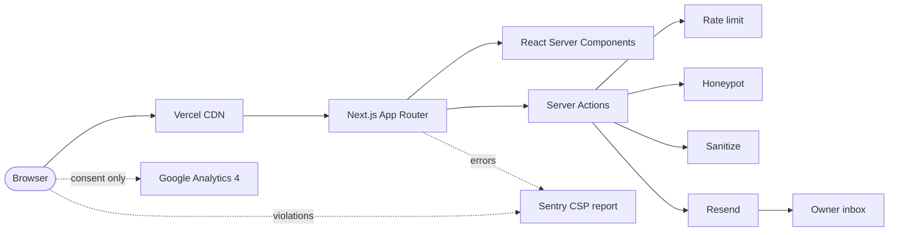
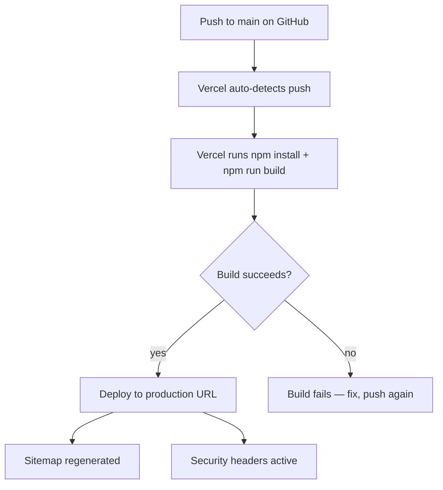

# Hjem Kensington — Website

> A small Danish bakery & specialty coffee shop on Gloucester Road, West London.
> This repo is the speculative demo build — built before the pitch, used as the
> sales asset when the conversation lands.

| | |
|---|---|
| **Framework** | Next.js 16.2.4 (App Router, Turbopack) |
| **Runtime** | React 19.2.4 |
| **Styling** | Tailwind v4 (CSS-first config) |
| **Node** | ≥20.0.0 (`.nvmrc` → `20`) |
| **License** | Private — all rights reserved |
| **Status** | Demo build — not yet deployed publicly |

---

## What this site is

A one-page brochure site with three legal pages bolted on. The homepage is the
whole pitch: hero carousel → story → today's bench → menu → testimonials → visit
→ contact. Visitors land, scroll, and either click "Get directions" or send a
message before they leave.

Designed to feel hand-crafted, not templated. Warm Danish café personality:
cream / moss / clay palette, Fraunces editorial display serif over DM Sans body,
quiet animation, generous whitespace.

---

## Stack at a glance



---

## Prerequisites

| Tool | Required version | Check command | Install |
|---|---|---|---|
| Node.js | ≥20.0.0 | `node --version` | https://nodejs.org/ or `nvm install 20` |
| npm | ≥10 (ships with Node 20) | `npm --version` | (bundled) |
| git | any recent | `git --version` | https://git-scm.com/ |
| Docker Desktop (optional) | any current | `docker --version` | https://docker.com/ |

> 💡 **Tip:** Run `nvm use` from the repo root if you have nvm — it picks
> Node 20 automatically because of the `.nvmrc` file.

---

## Local setup

### Path A — Direct (no Docker)

```powershell
# 1. Clone the repo
git clone https://github.com/Essam-Noureldin/hjem-kensington.git
cd hjem-kensington

# 2. Confirm Node 20
node --version            # should print v20.x.x

# 3. Install dependencies
npm install

# 4. Copy the env template
Copy-Item .env.example .env.local
# (or `cp .env.example .env.local` on macOS/Linux)

# 5. Start the dev server
npm run dev
```

Visit http://localhost:3000 — the homepage should render with no console errors,
the cookie banner should appear on first load, and the contact form should
accept submissions (which log to the server console in demo mode).

### Path B — Docker

```powershell
# 1. Clone, copy env (steps 1, 4 above)

# 2. Start the dev container with hot reload
docker compose up

# Visit http://localhost:3000
```

For Docker details, troubleshooting, and the production-preview path, see
[DOCKER.md](DOCKER.md).

---

## Folder structure

```
hjem-kensington/
├── app/                  Next.js routes (App Router)
├── components/           UI components (sections live in components/sections/)
├── lib/                  Shared utilities — env, sanitize, rate-limit, honeypot, email, sentry
├── tests/                Unit, integration, smoke
├── public/               Static assets (images live in public/images/)
├── docs/                 ← You are here
├── .husky/               Git hooks
├── next.config.ts        Headers + CSP + Sentry wrap
├── jest.config.ts        Test runner config
├── jest.setup.ts         Browser mocks (matchMedia, IntersectionObserver…)
├── Dockerfile            Multi-stage build
├── docker-compose.yml    Local dev
└── docker-compose.prod.yml  Production preview
```

For the annotated tree (with one-line explanations of every file and folder),
see [CLAUDE.md](CLAUDE.md).

---

## npm scripts

| Script | Command | What it does |
|---|---|---|
| `dev` | `next dev` | Start the dev server with Turbopack hot reload |
| `build` | `next build` | Production build → `.next/` (with `output: standalone`) |
| `postbuild` | `next-sitemap` | Auto-runs after `build`. Regenerates `public/sitemap.xml` and `public/robots.txt` |
| `start` | `next start` | Serve a built `.next/` (rarely used; standalone server is preferred) |
| `lint` | `eslint` | Lint the project |
| `typecheck` | `tsc --noEmit` | TypeScript check (no JS output) |
| `test` | `jest` | Run all tests |
| `test:watch` | `jest --watch` | Re-run tests on save |
| `test:ci` | `jest --ci --coverage --detectOpenHandles --passWithNoTests` | Full CI run with coverage report |
| `test:unit` | `jest --testPathPattern=unit --passWithNoTests` | Just the unit suite |
| `test:integration` | `jest --testPathPattern=integration --passWithNoTests` | Just the integration suite |
| `prepare` | `husky` | Auto-runs after `npm install` to wire up git hooks |

> ⚠️ **Always use `npm run build`, not `npx next build`.** The `postbuild`
> hook regenerates the sitemap and robots.txt — bypassing it leaves stale
> SEO metadata.

---

## Environment variables

A full reference lives in [.env.example](../.env.example) at the repo root.
Summary:

| Variable | Required? | Notes |
|---|---|---|
| `NEXT_PUBLIC_SITE_URL` | yes | Full URL, no trailing slash. Used by sitemap and OG tags. |
| `NEXT_PUBLIC_GA_ID` | optional | GA4 Measurement ID (`G-XXXXXXXXXX`). Empty = GA disabled. |
| `NEXT_PUBLIC_SENTRY_DSN` | optional | Empty = error reporting disabled. |
| `CONTACT_FORM_TO_EMAIL` | yes | Inbox that receives form submissions. |
| `CONTACT_FORM_FROM_EMAIL` | optional | Verified Resend sender. Empty = stub mode (logs only). |
| `RESEND_API_KEY` | optional | Empty = stub mode. |
| `RATE_LIMIT_MAX` | yes | Production default: 3. |
| `RATE_LIMIT_WINDOW_MS` | yes | Production default: 600000 (10 min). |
| `COOKIE_CONSENT_REQUIRED` | yes | `true` for UK / EU / California. |

For Vercel deployment, all required variables must be set in
**Settings → Environment Variables** for Production, Preview, and Development
environments before the first deploy.

---

## Deploying to Vercel



1. Push to GitHub.
2. In Vercel, **Add New Project** → import the `hjem-kensington` repo.
3. **Settings → Environment Variables** → add all required variables for
   the Production environment (see table above).
4. **Settings → Environment Variables** → repeat for Preview and Development.
5. Trigger a deploy (push any commit, or click **Redeploy** on the dashboard).
6. After first deploy: visit the live URL, submit the contact form, confirm
   the email arrives.

For the full pre-launch checklist, see the project root
[DELIVERY_CHECKLIST.md](../DELIVERY_CHECKLIST.md) (generated in Step 22).

---

## Running tests

```powershell
npx jest --ci --passWithNoTests        # full suite (used by pre-push hook)
npx jest --watch                       # interactive, re-runs on save
npx jest tests/unit/lib/env.test.ts    # single file
npx jest -t "honeypot"                 # tests matching a name
npm run test:ci                        # full CI run with coverage report
```

Coverage thresholds: **80%** across statements / branches / functions / lines.
CI fails below threshold.

For test philosophy, structure, and how to add new tests, see [TESTING.md](TESTING.md).

---

## Common setup issues

> ℹ️ **More gotchas catalogued in [ERRORS.md](ERRORS.md).** This list covers
> only the three you'll most likely hit on a fresh clone.

### Issue: `npm install` errors with peer-dep warnings about React 19

**Cause:** A dev dependency hasn't published a React 19-compatible version yet.
**Fix:** Read the warning. If it's a *warning* (not an error), npm installs the
package anyway — fine. If it's a hard error, check the package's GitHub issues
for a tracking issue; most have R19 support behind a `--legacy-peer-deps` flag.
Don't add `--legacy-peer-deps` permanently; treat it as a temporary bridge.

### Issue: `npm run build` fails with `Missing required env var(s): NEXT_PUBLIC_SITE_URL`

**Cause:** [lib/env.ts](../lib/env.ts) validates required env vars at module
load. `next build` runs with `NODE_ENV=production`, so the validation fires.
**Fix:** Set `NEXT_PUBLIC_SITE_URL` in `.env.local` (for local builds) or in the
Vercel dashboard (for deploys). Setting it to `http://localhost:3000` is fine
for local builds.

### Issue: dev server starts, but every page renders unstyled

**Cause:** Tailwind hasn't picked up `app/globals.css`. Most often: an old
`.next/` folder from a Tailwind v3 build is being served.
**Fix:**

```powershell
Remove-Item -Recurse -Force .next
npm run dev
```

---

## License

Private. All rights reserved. © Hjem Kensington. Code, copy, design system,
and brand assets are not licensed for reuse.
