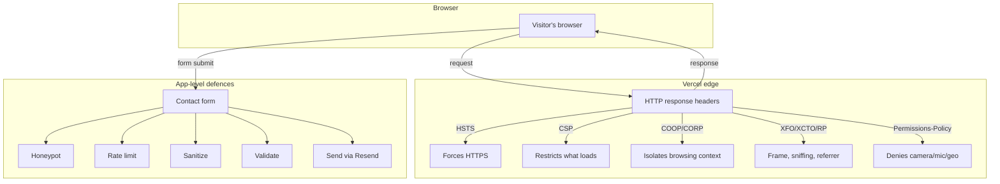
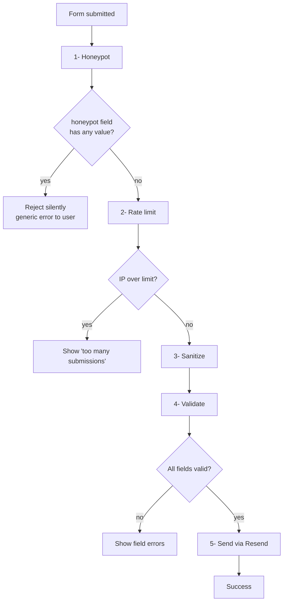
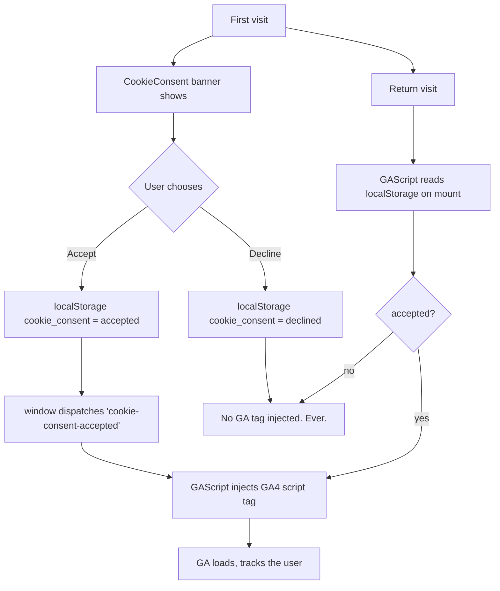
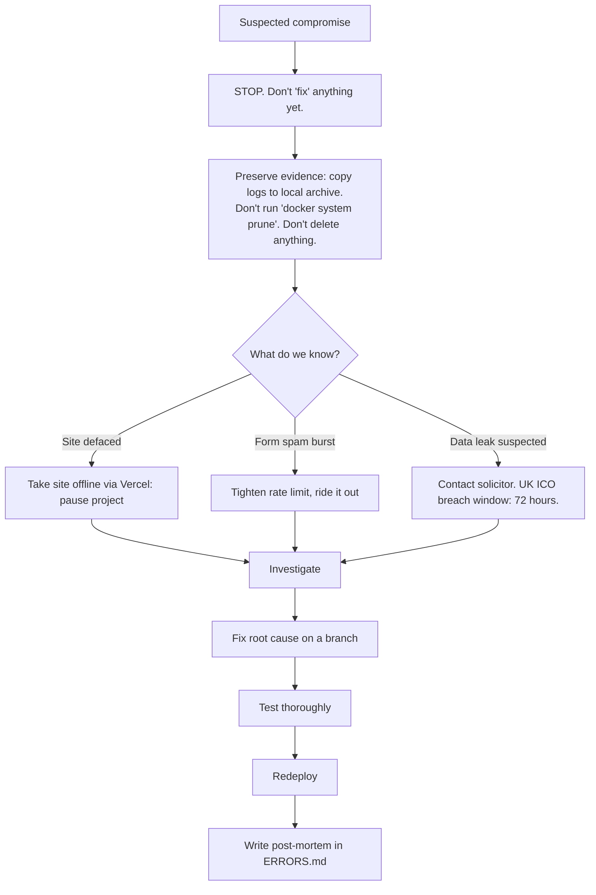

# SECURITY.md

The threat model, the defences, and the limits of those defences. Written so a
reader who isn't a security specialist can still understand what protects the
site and what doesn't.

---

## Scope of this document

> ℹ️ **Honest about what this covers:** Hjem Kensington is a brochure site
> with one form. It does not handle payments, hold user accounts, or store
> personal data beyond the contents of contact-form submissions in the
> recipient inbox. The threat model below is sized accordingly. A site
> handling payments or sensitive data needs more.

**What's protected:**

- The contact form against bots, spam, and injection
- The browser session against XSS, clickjacking, MIME sniffing, MITM downgrade
- The codebase against credential leakage in source
- The site against being embedded in other origins or hot-linked from them

**What's NOT in scope:**

- DDoS protection at scale (relies on Vercel's edge — fine for this size)
- Insider threats (anyone with Vercel/GitHub admin can do anything)
- Supply chain compromise of a deeply-buried npm package
- Targeted phishing of the site owner's email or Vercel credentials

---

## Defence layers — overall



---

## Security headers

Every response from the site carries these headers. They're set in
[next.config.ts](../next.config.ts) and applied via Next's `headers()` function
to **every** route — including 404s, API routes, and static assets.

| Header | Value (production) | What it stops | Plain English |
|---|---|---|---|
| `Content-Security-Policy` | (full directive list below) | XSS, malicious script injection | Whitelist of what scripts/images/styles the browser is allowed to load. Anything else is blocked. |
| `X-Frame-Options` | `DENY` | Clickjacking | Stops other websites from wrapping ours in an invisible iframe and tricking users into clicking |
| `X-Content-Type-Options` | `nosniff` | MIME sniffing attacks | Forces the browser to trust our declared `Content-Type` instead of guessing |
| `Referrer-Policy` | `strict-origin-when-cross-origin` | Referrer leaks | Cross-site links from our pages don't reveal the full URL the visitor came from |
| `Strict-Transport-Security` | `max-age=63072000; includeSubDomains; preload` | Downgrade to HTTP / MITM | Once a browser has visited us over HTTPS, it refuses to use HTTP for two years |
| `Permissions-Policy` | `camera=(), microphone=(), geolocation=(), interest-cohort=(), browsing-topics=()` | Camera/mic/location prompts via injected scripts; FLoC / Topics tracking | Even if someone injected a script, it couldn't open camera/mic prompts |
| `Cross-Origin-Opener-Policy` | `same-origin` | Spectre-class side channel; tab-nabbing via `window.opener` | Isolates our tab from windows we open or that opened us |
| `Cross-Origin-Resource-Policy` | `same-origin` | Cross-origin asset hot-linking; cross-origin Spectre reads | Blocks other sites from embedding our images or fetching our resources |
| `Reporting-Endpoints` | (when Sentry DSN set) | — (enables `report-to` CSP) | Tells the browser where to send CSP violation reports |

> 🚨 **Critical:** changing `next.config.ts` after wrapping with
> `withSentryConfig` can silently drop these headers. The
> [security-headers integration test](../tests/integration/api/security-headers.test.ts)
> is the regression guard — keep it green.

---

## CSP — Content Security Policy explained

The single strongest XSS defence on the site. It tells the browser:

| Directive | Value | Why |
|---|---|---|
| `default-src` | `'self'` | Block everything we haven't whitelisted |
| `script-src` | `'self' 'unsafe-inline' [GA hosts]` (`'unsafe-eval'` only in dev) | Our own bundles + GA when consent is given |
| `style-src` | `'self' 'unsafe-inline'` | Tailwind / Next ship inline styles for first paint |
| `font-src` | `'self' data:` | Self-hosted via `next/font/google` — no external font CDN |
| `img-src` | `'self' data: blob: [GA pixel]` | Self + Next image blur placeholders + GA tracking pixel |
| `connect-src` | `'self' [GA] [Sentry ingest]` | Server actions + analytics + error reports |
| `frame-src` | `'none'` | No iframes (yet — Google Maps would loosen this) |
| `frame-ancestors` | `'none'` | We can't be embedded in any iframe |
| `base-uri` | `'self'` | Stops attackers from injecting `<base href="evil.com">` |
| `form-action` | `'self'` | Forms can only submit to our own origin |
| `object-src` | `'none'` | No `<object>`, `<embed>`, `<applet>` — legacy attack surfaces |
| `upgrade-insecure-requests` | (production only) | Auto-upgrade `http://` → `https://` for embedded resources |
| `report-uri` + `report-to` | (Sentry, when DSN set) | CSP violations get reported to Sentry |

> 💡 **Why `'unsafe-inline'` for scripts:** Next.js injects small inline
> bootstrap scripts (route info, error boundaries) we can't easily nonce
> without reaching into framework internals. Other directives
> (`object-src 'none'`, `frame-ancestors 'none'`, `base-uri 'self'`) close
> the attack vectors that `'unsafe-inline'` would otherwise open.

---

## Contact form — the layered defence

The form is the only way a visitor can write to the server. Every layer can
fail-close.



| Layer | File | Purpose | What gets through if removed |
|---|---|---|---|
| 1 — Honeypot | [`lib/honeypot.ts`](../lib/honeypot.ts) | Detect bots that auto-fill all form fields | Spam from cheap bots floods the inbox |
| 2 — Rate limit | [`lib/rate-limit.ts`](../lib/rate-limit.ts) | Stop a single IP from drowning the form (3 / 10 min) | Sustained abuse from one source isn't bounded |
| 3 — Sanitize | [`lib/sanitize.ts`](../lib/sanitize.ts) | Strip HTML/script tags from input before processing | A malicious sender could inject HTML into the email body |
| 4 — Validate | [`app/actions/contact.ts`](../app/actions/contact.ts) | Reject empty / malformed fields, length limits | Empty or absurd-length submissions, malformed emails reaching Resend |
| 5 — Send | [`lib/email.ts`](../lib/email.ts) | Deliver via Resend, generic error to user on failure | Stack traces leak to the client |

### Important: the user never learns *which* layer rejected them

A bot that learns its honeypot was caught simply iterates around it. Same for
rate limiting. The form returns the same generic error for honeypot rejection
and server failure. Rate limiting is the only one we surface explicitly,
because a real human can hit it by accident and needs to know why.

---

## Rate limiting — how it works

```
Time window:        |---10 minutes---|---10 minutes---|---10 minutes---|

IP 1.2.3.4:         X  X  X  ⛔            X  X  X  ⛔
                    1  2  3  4 (blocked)    5  6  7  8 (blocked)

(window slides — entry at minute 0 ages out at minute 10, freeing a slot)
```

Storage: in-memory `Map<string, number[]>` keyed by IP, with TTL cleanup.

| Property | Value |
|---|---|
| Window | 10 minutes (`RATE_LIMIT_WINDOW_MS=600000`) |
| Max per window | 3 (`RATE_LIMIT_MAX=3`) |
| Storage | In-memory Map, per-Vercel-function instance |
| Resets when | Function cold start (Vercel) or process restart (Docker) |

> ⚠️ **Limitation of in-memory rate limiting on Vercel:** each serverless
> function instance has its own Map. If Vercel scales out, the same IP could
> hit each instance up to 3 times — effectively the limit becomes 3 × N
> instances. For a low-traffic brochure site this is acceptable; for a
> higher-traffic site, swap to Redis (Upstash). The interface in
> `lib/rate-limit.ts` is designed to make that swap a one-file change.

---

## Cookie consent and analytics

GA does not load before consent. Period.



This is GDPR/PECR-compliant for UK and EU visitors. `COOKIE_CONSENT_REQUIRED`
in env stays `true` for those jurisdictions.

For California (CCPA) the same banner satisfies "Do Not Sell My Information"
because we don't load tracking until consent is given. We do not currently
serve a CCPA-specific opt-out link — if the business expands US marketing
materially, that's worth adding.

---

## Where credentials live

| Credential | Where stored | Where exposed |
|---|---|---|
| `RESEND_API_KEY` | Vercel env (Production), `.env.local` (dev) | Server-only — never sent to browser |
| `CONTACT_FORM_TO_EMAIL` | Vercel env, `.env.local` | Server-only |
| `CONTACT_FORM_FROM_EMAIL` | Vercel env, `.env.local` | Server-only |
| `NEXT_PUBLIC_GA_ID` | Vercel env, `.env.local` | Public — appears in browser source. By design — GA4 IDs are public-safe. |
| `NEXT_PUBLIC_SENTRY_DSN` | Vercel env, `.env.local` | Public — Sentry DSNs are designed to be public |
| GitHub access | Essam's Personal Access Token | Stored in OS credential manager (Windows Credential Vault) |
| Vercel access | Email + 2FA | — |

> 🚨 **Critical:** never prefix a secret with `NEXT_PUBLIC_`. That prefix
> bundles the value into the browser JavaScript. Resend keys, database URLs,
> any auth secrets — never `NEXT_PUBLIC_*`.

---

## Security review schedule

| Task | Frequency | Owner | Last done |
|---|---|---|---|
| `npm audit --audit-level=high` | Monthly (in maintenance pass) | Essam | 2026-05-08 |
| Review Vercel access list | Quarterly | Essam | (n/a until client-handed) |
| Rotate Resend API key | When team membership changes / annually | Essam | (n/a) |
| Re-test security headers (run integration test on live URL via securityheaders.com) | After every infra change | Essam | (post-launch) |
| Review CSP for new external resources | Whenever a new external script/font/iframe is added | Essam | continuous |
| Browser DevTools spot check for CSP violations | Monthly | Essam | continuous |
| Sentry → CSP violations review | Monthly | Essam | continuous |
| Solicitor review of legal pages | Annually | Client | (deferred to client signing) |

---

## Incident response



> 🚨 **Critical:** preserve logs *before* any cleanup or fix attempt. Once
> you `git push --force` or `docker system prune`, the evidence trail is
> gone. Logs are usually all that lets you understand what actually happened.

---

## Things this site doesn't do (intentionally)

| Feature absent | Why we don't have it | Would add risk |
|---|---|---|
| User accounts / login | Brochure site doesn't need them | Auth is a huge surface area we don't need |
| Database | No data persisted server-side | Databases are credentials, queries, backups, leaks |
| Payments | Out of scope for the demo | PCI-DSS compliance |
| File uploads | The form is text-only | Malicious upload (malware, oversized, polyglot) |
| Comments / reviews | Testimonials are static curated content | UGC moderation, spam filtering |
| Open redirects | All `<Link>`s are internal or full URLs | Phishing |
| Server-side request forgery (SSRF) surface | No proxy or fetch from user-supplied URLs | Internal network access |

Each absence is a defence in itself: code that doesn't exist can't be exploited.

---

## Reporting a vulnerability

If you've found an issue: email Essam directly at the address in the repo's
git log (`git log --format='%ae' | sort -u`). Don't open a public GitHub
issue for security matters until a fix is deployed.
