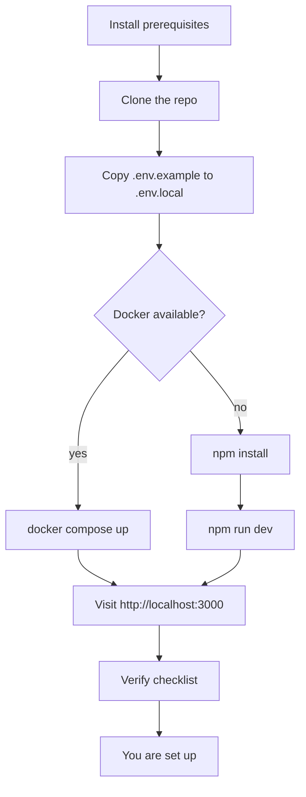
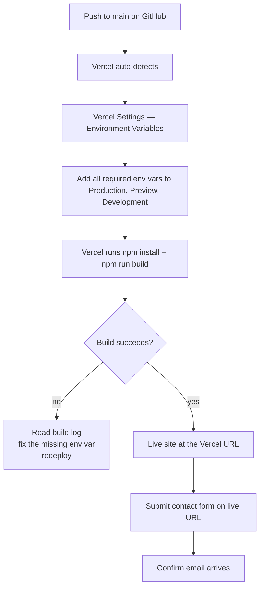

# SETUP.md

Step-by-step setup for a brand-new machine. Assumes nothing — if you've never
opened a terminal before, this should still get you running.

---

## Before you start

You'll need:

| Tool | Why | Check command | Install |
|---|---|---|---|
| Node.js 20+ | The runtime that builds and serves the site | `node --version` → `v20.x.x` | https://nodejs.org/ — click the **LTS** download |
| npm 10+ | Installs JavaScript packages. Comes bundled with Node | `npm --version` → `10.x` or higher | (bundled with Node) |
| git | Source control. Used to clone the repo and track changes | `git --version` → any recent | https://git-scm.com/downloads |
| A code editor | To open and edit files | n/a | VS Code: https://code.visualstudio.com/ |
| Docker Desktop *(optional)* | Run the site in a container — keeps your machine clean | `docker --version` | https://www.docker.com/products/docker-desktop |

> 💡 **Tip:** On Windows, install nvm-windows (https://github.com/coreybutler/nvm-windows)
> first, then `nvm install 20`. The repo's `.nvmrc` file means a future
> `nvm use` will pick the right version automatically.

---

## The whole flow at a glance



---

## Step 1 — Clone the repo

```powershell
# Pick a folder to clone into. The example uses Desktop.
cd "$env:USERPROFILE\Desktop"

# Clone
git clone https://github.com/Essam-Noureldin/hjem-kensington.git

# Move into it
cd hjem-kensington
```

**Expected output:** a `hjem-kensington` folder with subfolders like `app/`,
`components/`, `lib/`, `tests/`, `public/`, `docs/`.

---

## Step 2 — Confirm Node version

```powershell
node --version
```

**Expected:** `v20.x.x` (any 20.x is fine).

If you see a different major version (`v18.x`, `v22.x`):

```powershell
nvm install 20
nvm use 20
```

---

## Step 3 — Copy the env template

```powershell
Copy-Item .env.example .env.local
```

(macOS / Linux: `cp .env.example .env.local`)

`.env.local` is gitignored — your real values stay on your machine and never
end up in git history.

---

## Step 4 — Fill in `.env.local`

Open `.env.local` in your editor. The file has comments explaining each
variable; here's the short version:

| Variable | Plain English | Demo value | Required for dev? |
|---|---|---|---|
| `NEXT_PUBLIC_SITE_URL` | Where the site lives | `http://localhost:3000` | ✓ |
| `NEXT_PUBLIC_GA_ID` | Google Analytics ID. Empty = analytics off. | leave empty | — |
| `NEXT_PUBLIC_SENTRY_DSN` | Where errors get reported. Empty = errors logged to console only. | leave empty | — |
| `CONTACT_FORM_TO_EMAIL` | Inbox that receives form submissions | your email | ✓ |
| `CONTACT_FORM_FROM_EMAIL` | "From" address shown on outgoing emails. Must be verified in Resend. | leave empty | — |
| `RESEND_API_KEY` | Resend API key. Empty = stub mode (logs to console, no real email). | leave empty | — |
| `RATE_LIMIT_MAX` | Max contact-form submissions per IP per window | `3` | ✓ |
| `RATE_LIMIT_WINDOW_MS` | Window length in milliseconds (`600000` = 10 min) | `600000` | ✓ |
| `COOKIE_CONSENT_REQUIRED` | Show the consent banner | `true` | ✓ |

> 💡 **Tip:** For local dev, the only required values are `NEXT_PUBLIC_SITE_URL`,
> `CONTACT_FORM_TO_EMAIL`, `RATE_LIMIT_MAX`, `RATE_LIMIT_WINDOW_MS`, and
> `COOKIE_CONSENT_REQUIRED`. Everything else can stay empty in dev — the
> features they control degrade gracefully (GA off, errors console-only,
> contact form runs in stub mode).

---

## Step 5 — Install dependencies

```powershell
npm install
```

**Expected:** ~1–3 minutes. Some peer-dependency warnings about React 19 are
normal and not blocking. End of output should show no errors.

`npm install` also runs the `prepare` script, which wires up husky's git hooks.
You should see a `.husky/_/` folder appear after install.

---

## Step 6 — Start the dev server

```powershell
npm run dev
```

**Expected:** within ~5 seconds, a line like:

```
- Ready in 3.2s
- Local:   http://localhost:3000
```

Open http://localhost:3000 in your browser.

---

## Step 7 — Verify the install

In the browser:

| Check | Pass criterion |
|---|---|
| Homepage loads | You see the Hjem hero with rotating images |
| Cookie banner appears | A bottom-of-screen banner with **Accept** / **Decline** buttons |
| Browser console is clean | DevTools → Console shows no red errors. (Some Next.js dev warnings about Turbopack or HMR are normal.) |
| Navigation works | Clicking **Story / Menu / Visit** scrolls smoothly to the right section |
| Footer links resolve | Clicking **Privacy Policy** loads `/privacy-policy` without a 404 |
| Contact form submits | Fill the form → click **Send message** → see a success message under the button |

In the terminal (where `npm run dev` is running):

| Check | Pass criterion |
|---|---|
| Submitting the form logs to the console | You see a JSON-ish object with the sanitized fields (Resend stub mode) |
| No red error stack traces | Form submissions, navigation, page loads — none of them throw |

If all of those pass, **you are set up.** Congratulations.

---

## Deploying to Vercel



1. Sign up at https://vercel.com (free for hobby projects).
2. **Add New Project** → **Import** the GitHub repo.
3. **Settings → Environment Variables** → for each of the variables in step 4
   above, **add the same variable** to Production, Preview, and Development.
4. Click **Deploy**.
5. After deploy: visit the live URL, submit the contact form, confirm the
   email arrives in `CONTACT_FORM_TO_EMAIL`.

---

## Common errors

| Error you see | Likely cause | Fix |
|---|---|---|
| `EACCES: permission denied` on `npm install` | Running with the wrong user, or `node_modules` owned by root | Delete `node_modules` and `package-lock.json`, run `npm install` again as your normal user |
| `Cannot find module '@/lib/env'` | Path alias misconfigured | Check `tsconfig.json` `paths` and `jest.config.ts` `moduleNameMapper` — they must match |
| `Missing required env var(s): NEXT_PUBLIC_SITE_URL` on `npm run build` | `.env.local` doesn't have `NEXT_PUBLIC_SITE_URL` set | Add it to `.env.local` (or to Vercel for deploys) |
| Dev server starts but pages render unstyled | Stale `.next/` from an earlier Tailwind v3 build | `Remove-Item -Recurse -Force .next; npm run dev` |
| `Error: connect EADDRINUSE :::3000` | Another process is using port 3000 | Stop the other process, or run `npm run dev -- --port 3001` |
| Cookie banner never disappears | localStorage is being cleared each load (incognito on some browsers) | Open in a regular tab. Incognito clears state on close, so the banner reappears every visit by design. |
| Tests fail with `window is not defined` | A server-only test is running in jsdom | Add `@jest-environment node` docblock to the top of the test file |

For a fuller error catalogue, see [ERRORS.md](ERRORS.md).

---

## What to read next

| If you want to… | Go to |
|---|---|
| Understand how the system fits together | [ARCHITECTURE.md](ARCHITECTURE.md) |
| Run the site in Docker | [DOCKER.md](DOCKER.md) |
| Add a new test or fix a flaky one | [TESTING.md](TESTING.md) |
| Modify colours, fonts, or animations | [DESIGN.md](DESIGN.md) |
| Replace placeholder images with real ones | [IMAGES.md](IMAGES.md) |
