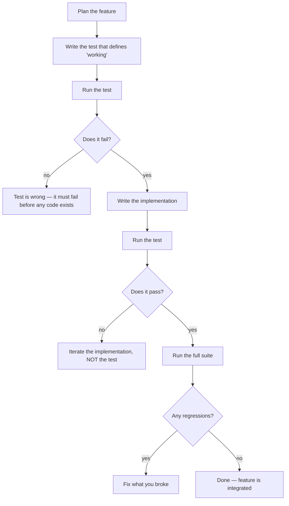
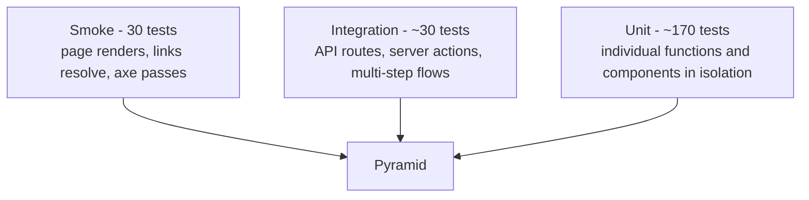

# TESTING.md

How tests are organised on this project, the philosophy behind that
organisation, and how to add new tests when adding features.

---

## The rule

> **No code is considered done until its tests pass.**
> **No feature is integrated until it has been tested in isolation first.**

The test-first workflow:



> ⚠️ **Don't write the implementation first and the test after.** Tests
> written after the code tend to confirm whatever the code already does —
> including its bugs. Tests written first describe the *intent*, and
> implementation passes them by being correct.

---

## Test pyramid for this project



| Tier | Count | Speed | Coverage |
|---|---|---|---|
| Unit | ~170 tests | Fast (~5s) | Most of the suite — every utility, every component in isolation |
| Integration | ~30 tests | Medium | Server actions, security headers, cookie-consent + GA flow, legal pages |
| Smoke | 30 tests | Medium-slow | Render, navigation, accessibility (axe-core) |
| **Total** | **227** | **~12s** | **94.83% statements / 89.56% branches / 89.87% functions / 96.40% lines** |

Coverage gates: **80% across all four metrics.** CI fails below threshold.

The shape is intentional: many fast unit tests catch most regressions; a
smaller number of integration tests catch wiring issues; a handful of smoke
tests prove the assembled site doesn't catch fire.

---

## Folder structure

```
tests/
├── unit/
│   ├── lib/                    Utility functions in isolation
│   │   ├── env.test.ts             validate() pure function
│   │   ├── sanitize.test.ts        stripHtml()
│   │   ├── rate-limit.test.ts      sliding-window logic
│   │   ├── honeypot.test.ts        isHoneypotFilled()
│   │   ├── email.test.ts           Resend wrapper, stub mode
│   │   └── sentry.test.ts          getCspReportUrl()
│   └── components/             Component behaviour, not implementation
│       ├── Navbar.test.tsx
│       ├── Footer.test.tsx
│       ├── ContactForm.test.tsx
│       ├── CookieConsent.test.tsx
│       ├── Carousel.test.tsx
│       └── sections/
│           ├── Hero.test.tsx
│           ├── Story.test.tsx
│           ├── TodaysBench.test.tsx
│           ├── Menu.test.tsx
│           ├── Testimonials.test.tsx
│           ├── Visit.test.tsx
│           └── Contact.test.tsx
├── integration/
│   ├── api/
│   │   ├── contact-form.test.ts        Server action with all defences
│   │   └── security-headers.test.ts    HTTP-level header check (Node env)
│   └── flows/
│       ├── legal-pages.test.tsx        All three legal routes resolve
│       └── cookie-consent-ga.test.tsx  GA only loads after consent
└── smoke/
    ├── render.test.tsx             Pages render without console errors
    ├── navigation.test.tsx         Every link resolves to a real target
    └── accessibility.test.tsx      jest-axe scan on every page
```

The folder layout mirrors the source: `tests/unit/lib/sanitize.test.ts` tests
`lib/sanitize.ts`. Easy to find, easy to add to.

---

## Test types — when to use which

| Type | Use when | Example |
|---|---|---|
| **Unit** | Testing one function or one component, in isolation, with mocked dependencies | `stripHtml('hello <b>world</b>') === 'hello world'` |
| **Integration** | Testing how multiple pieces work together — across the network boundary, or a multi-step user journey | "Submit the contact form → server action runs honeypot → rate limit → sanitize → calls email wrapper" |
| **Smoke** | Last-line-of-defence checks: did this page render at all? Are the links real? Does it pass axe? | "Open homepage, assert no console.error, assert axe passes" |

Most new features need a unit test. Some need integration too. Smoke tests
generally don't need to expand — they cover the page-level invariants.

---

## How to run tests

```powershell
# Full suite — slow (~12s)
npx jest --ci --passWithNoTests

# Watch mode — re-runs on file save
npx jest --watch

# Just one file
npx jest tests/unit/lib/sanitize.test.ts

# Tests matching a name
npx jest -t "honeypot"

# Just unit
npm run test:unit

# Just integration
npm run test:integration

# CI run with coverage report
npm run test:ci

# Update snapshots (use sparingly — review the diff)
npx jest -u
```

The pre-push git hook runs `npx jest --ci --passWithNoTests` automatically.
Failed tests block the push.

---

## How to read a coverage report

After `npm run test:ci`, a coverage report prints to console and writes to
`coverage/lcov-report/index.html` (open in browser).

| Metric | What it means | Target |
|---|---|---|
| Statements | Lines of code executed | ≥ 80% |
| Branches | If/else paths exercised | ≥ 80% |
| Functions | Functions called at least once | ≥ 80% |
| Lines | Same as statements but counted by line | ≥ 80% |

> 💡 **Tip:** 100% coverage is not the goal. 80% with good tests is better
> than 100% with shallow tests. If the test only proves the code runs (no
> meaningful assertions), the coverage number is lying.

The HTML report colour-codes:

- **Green:** covered
- **Red:** not executed at all
- **Yellow:** partially covered (some branches missed)

Look at red lines first. Are they unreachable code (dead — delete it)?
Or actually-reachable but-untested? If the latter, write the test.

---

## How to add a new test (worked example)

You're adding a new utility, `lib/format-time.ts`, that turns a 24-hour
string into a friendly format.

### Step 1 — Write the test first

```typescript
// tests/unit/lib/format-time.test.ts
import { formatTime } from "@/lib/format-time";

describe("formatTime", () => {
  it("formats morning times correctly", () => {
    expect(formatTime("07:30")).toBe("7:30 AM");
  });

  it("formats afternoon times correctly", () => {
    expect(formatTime("14:00")).toBe("2:00 PM");
  });

  it("returns empty string for invalid input", () => {
    expect(formatTime("not-a-time")).toBe("");
  });
});
```

### Step 2 — Run it (it must fail)

```powershell
npx jest tests/unit/lib/format-time.test.ts
```

You should see `FAIL` because `lib/format-time.ts` doesn't exist yet. That's
the green light to write code.

### Step 3 — Write the implementation

```typescript
// lib/format-time.ts
export function formatTime(input: string): string {
  // ... implementation
}
```

### Step 4 — Run the test again

```powershell
npx jest tests/unit/lib/format-time.test.ts
```

Iterate until it passes.

### Step 5 — Run the full suite

```powershell
npx jest --ci --passWithNoTests
```

Confirm nothing else broke. If something did, fix the regression — don't
delete the failing test.

---

## What makes a good test

| Good test | Bad test |
|---|---|
| Asserts behaviour visible to the caller | Asserts internal implementation details |
| Has a name that describes the scenario | Named `test1`, `it works`, etc. |
| Fails when the behaviour breaks | Always passes — coverage padding |
| Independent of test order | Depends on `beforeAll` global state |
| Uses real dates and numbers | Mocks everything until the test means nothing |
| Reads in plain English | Requires the implementation to make sense |

> 💡 **Tip:** if the test breaks every time the implementation changes
> (without changing behaviour), the test is testing the wrong thing.

---

## Mocks and fixtures

We use Mock Service Worker (`msw`) for HTTP-level mocking and Jest's built-in
`jest.fn()` for function-level mocking.

| Mock type | Use for |
|---|---|
| `jest.fn()` | Replacing a single function (`Resend.send`, etc.) |
| `jest.spyOn(console, "error")` | Watching console output without breaking it |
| `msw` setup | Faking external HTTP APIs in integration tests |
| Inline mock components | Replacing a complex child for a parent component test |

Browser mocks live in [jest.setup.ts](../jest.setup.ts):

| Mock | Why |
|---|---|
| `window.matchMedia` returns `matches: true` for `prefers-reduced-motion` | Prevents Framer Motion animations during tests; prevents axe false positives |
| `IntersectionObserver` | jsdom doesn't implement it; lazy-load components crash without |
| `ResizeObserver` | Same — Tailwind utilities and many UI libs depend on it |

---

## Common test pitfalls

| Mistake | Why it fails | Fix |
|---|---|---|
| Reading `localStorage` outside `beforeEach` cleanup | Test pollution — one test's writes affect the next | Always `localStorage.clear()` in a setup hook |
| Asserting on text content with case sensitivity | Site copy changes case mid-design-pass | Use Testing Library's `name: /pattern/i` regex match |
| Mocking the thing under test | The mock now defines correctness, not the implementation | Mock the dependencies, not the subject |
| Snapshot tests for entire pages | Snapshots churn on every cosmetic change | Use targeted assertions instead |
| Server-only code in jsdom | `window is not defined` or `fs is not defined` | Add `@jest-environment node` docblock |
| Deleting a failing test to "fix" CI | Hides the bug | Find why it fails. Either fix the code or fix the test deliberately. |

---

## When you must skip a test

Sometimes a test is genuinely incorrect for a temporary reason (flaky
external dep, broken upstream library version). Skip it explicitly:

```typescript
it.skip("flaky on Windows runners — re-enable when X is patched", () => {
  // ...
});
```

> ⚠️ **Skipping ≠ deleting.** A `.skip` makes the intent visible. Other
> developers can see the test exists, why it's off, and re-enable it later.
> Deleting silently is what destroys institutional memory.

Add a corresponding row to [ERRORS.md](ERRORS.md) with the reason. Don't
ship `.skip` permanently — they should rot off as their conditions resolve.

---

## Pre-integration gate (before merging any feature)

Before merging a feature branch:

```
□ Unit tests for new functions/components written and passing
□ Integration tests for new API routes / data flows passing
□ Full suite passes: npm run test:ci
□ Coverage thresholds met (80% across all four)
□ TypeScript clean: npx tsc --noEmit
□ ESLint clean: npx eslint . --max-warnings 0
□ Production build succeeds: npm run build
□ For UI changes: tested in browser at 375px and 1280px
□ For external script/font/iframe added: CSP whitelist updated, headers test green
```

The pre-commit and pre-push git hooks enforce most of this. The mobile
viewport check is on you.

---

## Why we use jest-axe, not @axe-core/react

The master prompt named `@axe-core/react`, but it's a runtime browser logger
that prints to the console — it doesn't expose Jest assertions. `jest-axe`
is the proper Jest-matcher integration. Logged in
[MASTER_PROMPT_DEVIATIONS.md](../MASTER_PROMPT_DEVIATIONS.md) as deviation 10.1.

```typescript
import { axe, toHaveNoViolations } from "jest-axe";
expect.extend(toHaveNoViolations);

it("homepage has no accessibility violations", async () => {
  const { container } = render(<HomePage />);
  const results = await axe(container);
  expect(results).toHaveNoViolations();
});
```

The `region` rule is disabled in the smoke config — well-landmarked pages
don't need every text element wrapped in `<main>` / `<nav>` / `<footer>`.
Justification in deviation 10.2.
