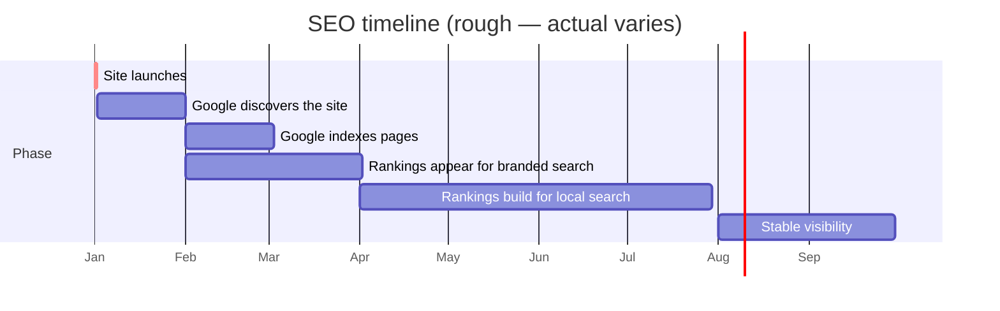

# Your Website — A Plain English Guide

Hello. This is the guide for *you* — the person who runs Hjem. Not for a
developer. Every word is plain English; if a technical term turns up, it'll
be explained in brackets right after.

If anything is confusing, that's our fault, not yours. Email us and we'll
clarify.

---

## What this document is

A reference for everything you might want to know about your website *without*
needing a developer to explain it. Bookmark it. Skim the headings. Come back
when you have a question.

---

## What's on your site

| Page | Web address | What it's for |
|---|---|---|
| Home | `/` | The whole pitch — your story, today's bench, menu, testimonials, where to find you, contact |
| Privacy Policy | `/privacy-policy` | Required by law. Explains what data you collect from visitors. |
| Terms & Conditions | `/terms-and-conditions` | Required by law. Sets the ground rules for using your site. |
| Cookie Policy | `/cookie-policy` | Required by law. Explains the small files browsers store. |

The "/" in front of each address means "after your domain". So if your domain
is `hjemkensington.com`, your privacy policy lives at
`hjemkensington.com/privacy-policy`.

---

## Layout of the homepage

Here's what a visitor sees as they scroll, top to bottom:

```
┌──────────────────────────────────────────┐
│   ☰   Hjem            Story  Menu  Visit │ ← Sticky navigation (always visible)
├──────────────────────────────────────────┤
│                                          │
│            Velkommen                     │ ← HERO — rotating photos
│         Visit us  →                      │   3 slides, auto-rotating
│                                          │
├──────────────────────────────────────────┤
│   STORY — who Hjem is, the people,       │
│   the why                                │
├──────────────────────────────────────────┤
│   TODAY'S BENCH — what's good today      │
│   (4 cards: cardamom buns, flat white,   │
│   matcha, sourdough)                     │
├──────────────────────────────────────────┤
│   MENU — carousel of menu sections       │
├──────────────────────────────────────────┤
│   TESTIMONIALS — three reviews,          │
│   each with a customer photo             │
├──────────────────────────────────────────┤
│   VISIT — address, hours, getting here   │
├──────────────────────────────────────────┤
│   CONTACT — name, email, message form    │
├──────────────────────────────────────────┤
│   FOOTER — Hjem wordmark, legal links,   │ ← Always at the bottom
│   Instagram, copyright                   │
└──────────────────────────────────────────┘
```

---

## How to share your website

Once your site is live, here's how to point people at it.

### WhatsApp / iMessage

Open WhatsApp → start a chat → paste the full URL. WhatsApp turns it into a
preview card with your hero image, title, and a short description. Send.

### Email signature

Open Gmail (or whichever email tool you use) → Settings → Signature → add:

```
Best,
[Your name]
Hjem Kensington
[Your phone]
hjemkensington.com
```

The URL becomes a clickable link in every email you send.

### Instagram bio

Open Instagram → your profile → Edit profile → Website field → paste the URL.
Save. Now your bio link goes to your site.

### Google Business Profile

This is the one that matters most for being found.

1. Go to https://business.google.com/
2. Sign in with the Google account you use for Hjem
3. Click your business → **Edit profile** → **Contact info**
4. Find the **Website** field → paste your URL
5. Save

Your website now appears next to your map listing on Google Maps and in
Google Search results. This is the single biggest move for new customers
finding you online.

---

## Asking for changes

The fastest way to get a change made is to email us with this template:

> Hi Essam,
>
> Could you make this change to my website:
>
> **What:** [the change in plain English]
>
> **Where:** [which page, or which section]
>
> **Example:** [a sentence or two showing what you want — old version → new version]
>
> Thanks,
> [your name]

The more concrete the example, the faster the change happens. If you're
unsure how to describe it, send a screenshot with arrows.

### What's quick (free in your retainer)

| Type of change | Example | Typical turnaround |
|---|---|---|
| Text edit | "Change opening hours from 7:30 to 7:00" | Same day |
| Image swap | "Replace the hero image with this new shot" | Within 2 days |
| Adding a testimonial | "Here's a new customer review, can you add it?" | Within 2 days |
| Phone number / email update | "Our phone number changed" | Same day |
| Removing a section | "Take down the testimonials section" | Within 2 days |

### What's bigger (additional cost)

| Type of change | Example | Typical turnaround | Why it costs more |
|---|---|---|---|
| New section | "Add a 'Wholesale' section" | 1–2 weeks | Design + build + test + legal review |
| Online ordering | "Let people order online" | 4–8 weeks | New systems, payment processor, T&Cs update, legal review |
| Newsletter signup | "Add a Mailchimp form" | 1–2 weeks | Privacy Policy update, GDPR consent flow |
| Major redesign | "I want a different colour palette" | 2–4 weeks | Touches every page |
| New language version | "Add Danish translation" | 2–3 weeks | Translation + a routing change |

We'll always quote you before starting any "bigger" work, never surprise you
with a bill.

---

## What your monthly retainer covers

```
✓ Hosting (Vercel)
✓ Domain renewal (when due)
✓ SSL certificate (auto-renewed by Vercel)
✓ Up to 1 hour of small text/image changes per month (rolls over up to 3 hours)
✓ Monthly health check (the maintenance pass)
✓ Security patches when needed
✓ Quarterly Lighthouse + accessibility check
✓ Email support (next-business-day response)
✓ Annual legal page review (just the technical update — solicitor fees separate)
```

Outside the retainer:

```
✗ Solicitor fees for legal review
✗ New section design + build (quoted separately)
✗ Photography (we'd recommend a photographer if you want)
✗ Copywriting for new sections (we'd recommend a copywriter or do it together)
✗ Print marketing, email campaigns, social media management
```

---

## What happens if you stop the retainer

We don't lock you in. If you decide to part ways:

1. We give 30 days' notice in either direction.
2. Your site keeps running on whatever hosting it was on (you'll need to take
   over the Vercel account, which we'll walk you through).
3. We hand over all credentials, code (which you own), and documentation.
4. You can hire any developer to take over — the site is built on standard
   technology that any modern developer can pick up.

No bridges burned. We'd rather you had a working website than a dependency
on us.

---

## How long until Google starts sending people to your site?



In plain numbers:

| Time since launch | What to expect |
|---|---|
| 1 month | Google has found your site. Searching for "Hjem Kensington" by exact name finds you. |
| 2–4 months | Google has indexed every page. Searches with your name + a keyword (e.g. "Hjem Kensington sourdough") work. |
| 4–8 months | "Bakery Kensington" type searches start showing your site (with help from Google Business Profile). |
| 8–12 months | Stable appearance for the searches that match your business. |

Things that speed this up:

- Posting your URL on social media (Instagram bio is the easiest)
- Linking from your Google Business Profile
- A few customers leaving reviews on Google
- Local press / blogger mentions (links from other sites help a lot)

Things that *don't* matter as much as people think:

- Adding meta keywords (Google ignores them)
- Stuffing keywords into copy (Google penalises this)
- Buying SEO services from cold email (mostly snake oil for local businesses)

---

## Frequently asked questions

| Q | A |
|---|---|
| Will my website work on phones? | Yes. It's mobile-first — phones are actually the priority view. |
| Will it work on slow internet? | Yes. We tuned it for that. The first paint should appear in well under 2 seconds even on 4G. |
| What happens if my site goes down? | Vercel has very rare outages. If it happens, we get an alert and respond. |
| Can I edit the site myself? | Not without code knowledge. By design — letting non-developers edit live sites tends to break things. We make changes for you within the retainer. |
| What about ranking #1 on Google? | "#1" depends on the search term. For "Hjem Kensington" we should rank #1 within a few months. For "bakery near me" — that's down to Google Maps, your Google reviews, and reality. We can't guarantee it. |
| Will visitors see ads? | No. Your site doesn't run ads. |
| Can someone hack my site? | Nothing is unhackable, but the site has standard defences (covered in [SECURITY.md](SECURITY.md)). The most likely risk is your own email getting phished — we'd recommend 2FA on every account that touches the site. |
| Do I own the code? | Yes. Your retainer pays for hosting, maintenance, and changes. The code is yours. |
| What about GDPR? | Your site has a cookie banner and the legal pages. The legal pages need a solicitor review before launch — that's noted in [LEGAL.md](LEGAL.md). |
| Where do contact form messages go? | To your inbox (whichever email we set up `CONTACT_FORM_TO_EMAIL` to point at). |

---

## When to call us vs when to call someone else

| Situation | Who to call |
|---|---|
| Site is down / slow / something looks broken | Us |
| Someone left a bad review on Google | Not us — that's reputation management |
| You want a logo redesign | Not us — that's a graphic designer |
| You need new photos | Not us — that's a photographer (we can recommend one) |
| You want to start an Instagram strategy | Not us — that's a social media manager |
| You want to send out a newsletter | We can build the integration; the *writing* is yours |
| You're worried something is illegal | Solicitor first, then us |
| Customer says they didn't get a response to their form | Us — we'll check the logs |

We're your website team. We're not your marketing team, your PR team, your
designer, or your lawyer. We can recommend trusted folks for any of those.

---

## A note on patience

A new website is like a new shop window. It takes a while for people to walk
past, notice it, and remember it's there. Don't worry if traffic is slow in
the first few months — that's normal. The site is built so that *when* the
traffic comes, the site is ready for it.

In the meantime: share the URL, link it from your Google Business Profile,
mention it on Instagram. Each share counts.

Best of luck. Email us any time.
